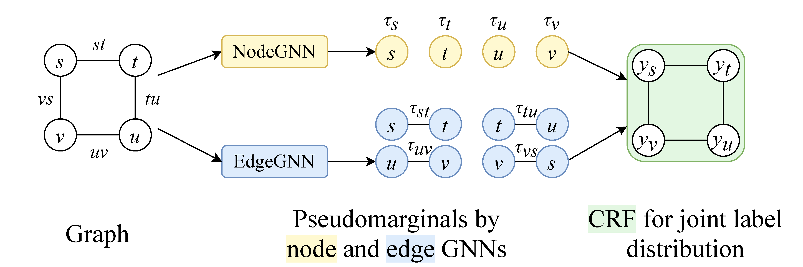
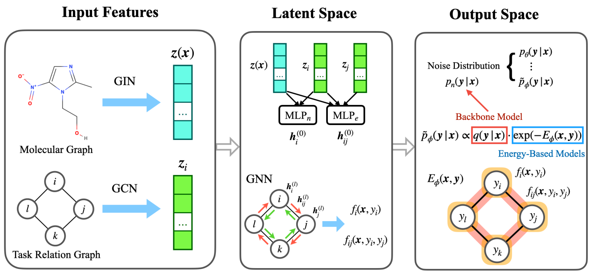
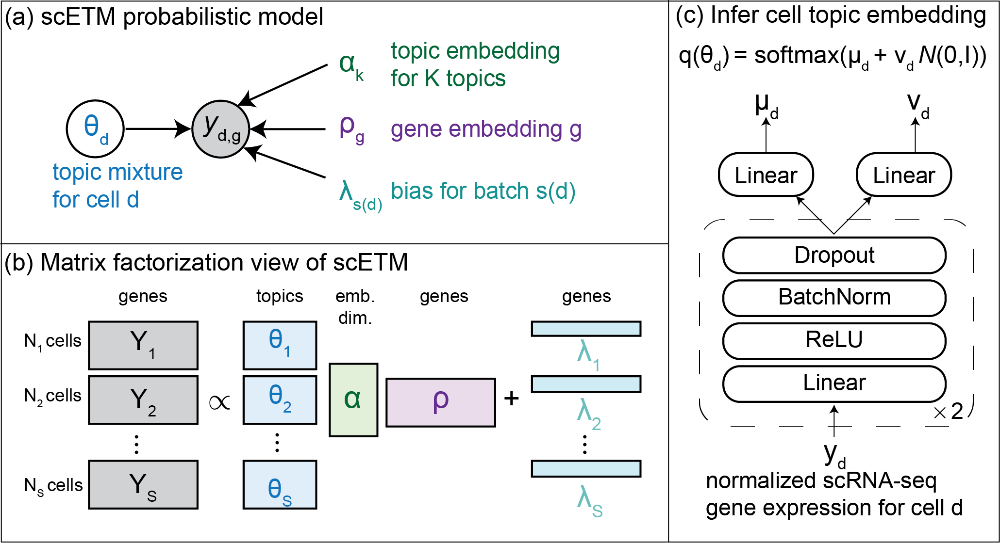
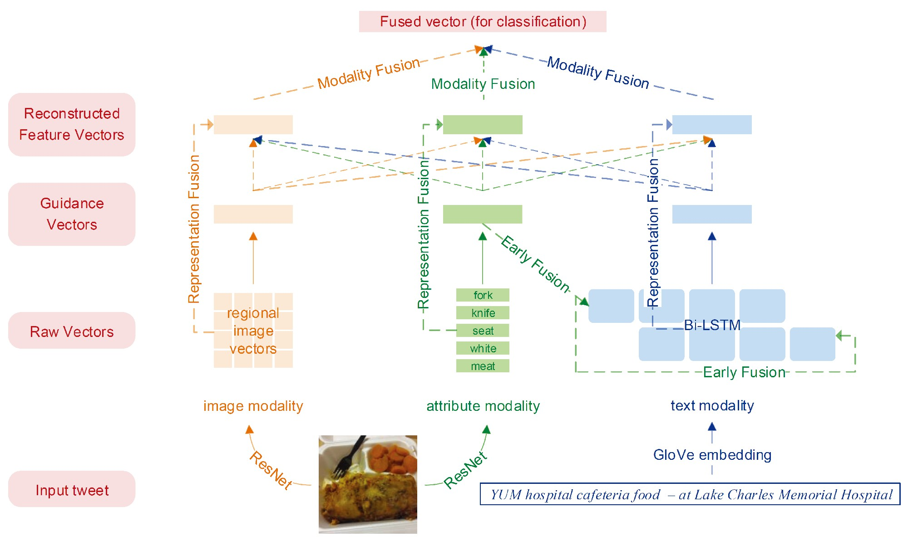

# Huiyu CAI 蔡辉宇

{: align=right style="width: 25%" }

I am a first-year PhD student at <a href="https://mila.quebec/en">Mila - Quebec AI Institute</a> and <a href="https://diro.umontreal.ca/english/home/">Department of Computer Science and Operations Research</a>, <a href="https://www.umontreal.ca/en/">University of Montreal</a>, supervised by Prof. <a href="https://jian-tang.com">Jian Tang</a>. I graduated from the <a href="http://www.cis.pku.edu.cn/">Department of Machine Intelligence</a>,
<a href="http://www.pku.edu.cn">Peking University</a> as an *Excellent Graduate in Beijing*.
I was previously a member of the Language Computing and Web Mining Group,
led by <a href="https://wanxiaojun.github.io/">Prof. Xiaojun Wan</a>.

I am interested in deep generative models, graph representation learning and their wide applications,
such as drug discovery, single-cell modeling, etc.

Feel free to reach out (links at [webpage footer](#index_bottom))!

## Publications

### 2022

{: align=right style="width: 23%" }

- [**Neural Structured Prediction for Inductive Node Classification**](https://openreview.net/forum?id=YWNAX0caEjI) <em>ICLR</em>, 2022 (oral) <a href="https://mnqu.github.io/">Meng Qu*</a>, <strong>Huiyu Cai*</strong>, <a href="https://jian-tang.com">Jian Tang</a> *<em>Equal contribution</em>

{: align=right style="width: 23%" }

- [**Structured Multi-task Learning for Molecular Property Prediction**](http://aistats.org/aistats2022/) <em>AISTATS</em>, 2022 <a href="https://chao1224.github.io/">Shengchao Liu</a>, <a href="https://mnqu.github.io/">Meng Qu</a>, <a href="https://oxer11.github.io/">Zuobai Zhang</a>, <strong>Huiyu Cai</strong>, <a href="https://jian-tang.com">Jian Tang</a>

### 2021 and before

{: align=right style="width: 23%" }

- [**Learning interpretable cellular and gene signature embeddings from single-cell transcriptomic data**](https://www.biorxiv.org/content/10.1101/2021.01.13.426593v2) <em>Nature Communications</em>, 2021 &emsp;[code](https://github.com/hui2000ji/scETM) <a href="https://yifnzhao.github.io/">Yifan Zhao</a>\*, <strong>Huiyu Cai</strong>\*, <a href="https://oxer11.github.io/">Zuobai Zhang</a>, <a href="https://jian-tang.com">Jian Tang</a>, <a href="https://www.cs.mcgill.ca/~yueli/">Yue Li</a>  *<em>Equal contribution</em>

{: align=right style="width: 23%" }

- [**Multi-Modal Sarcasm Detection in Twitter with Hierarchical Fusion Model**](https://www.aclweb.org/anthology/P19-1239/)  <em>ACL</em>, 2019 &emsp;[data](https://github.com/headacheboy/data-of-multimodal-sarcasm-detection) Yitao Cai, <strong>Huiyu Cai</strong>, <a href="https://wanxiaojun.github.io/">Xiaojun Wan</a>

## Projects
- [**TorchDrug: A powerful and flexible machine learning platform for drug discovery**](https://torchdrug.ai/) (Nov. 2021 - now)
- [**Implementation of the EWLS Algorithm for the Maximum Clique Problem**](assets/codes/EWLS.cpp) (Dec. 2020 - Jan. 2021)
- **Music Source Separation: Theory and Applications** (Apr. 2020 - Jun. 2020)
- [**Raiden Game Implementation in Java**](https://github.com/hui2000ji/RaidenGame) (Jan. 2020 - Jun. 2020)
- [**Fine-grained Face Manipulation via DLGAN**](https://github.com/sunyaofeng8/AI-Intro) (Oct. 2019 - Jan. 2020)
- **Bird Sound Classification with CNN** (Mar. 2019 - Jun. 2019)
- **[Mahjong](https://www.botzone.org.cn/game/Mahjong-GB) AI Based on Deep Supervised Learning** (Mar. 2019 - Jun. 2019)
- **Rule-based [Doudizhu](https://www.botzone.org.cn/game/FightTheLandlord2) & [Ataxx](https://www.botzone.org.cn/game/Ataxx) & [Reversi](https://www.botzone.org.cn/game/Reversi) & [pysc2-minimap](https://github.com/deepmind/pysc2) AI** (Oct. 2017 - May. 2019)

<!-- ## Color Palette

Click on a tile to change the **color scheme**:

  <button data-md-color-scheme="default"><code>default</code></button>
  <button data-md-color-scheme="slate"><code>slate</code></button>

Click on a tile to change the **primary color**:

  <button data-md-color-primary="red"><code>red</code></button>
  <button data-md-color-primary="pink"><code>pink</code></button>
  <button data-md-color-primary="purple"><code>purple</code></button>
  <button data-md-color-primary="deep-purple"><code>deep purple</code></button>
  <button data-md-color-primary="indigo"><code>indigo</code></button>
  <button data-md-color-primary="blue"><code>blue</code></button>
  <button data-md-color-primary="light-blue"><code>light blue</code></button>
  <button data-md-color-primary="cyan"><code>cyan</code></button>
  <button data-md-color-primary="teal"><code>teal</code></button>
  <button data-md-color-primary="green"><code>green</code></button>
  <button data-md-color-primary="light-green"><code>light green</code></button>
  <button data-md-color-primary="lime"><code>lime</code></button>
  <button data-md-color-primary="yellow"><code>yellow</code></button>
  <button data-md-color-primary="amber"><code>amber</code></button>
  <button data-md-color-primary="orange"><code>orange</code></button>
  <button data-md-color-primary="deep-orange"><code>deep orange</code></button>
  <button data-md-color-primary="brown"><code>brown</code></button>
  <button data-md-color-primary="grey"><code>grey</code></button>
  <button data-md-color-primary="blue-grey"><code>blue grey</code></button>
  <button data-md-color-primary="black"><code>black</code></button>
  <button data-md-color-primary="white"><code>white</code></button>

Click on a tile to change the **accent color**:

  <button data-md-color-accent="red"><code>red</code></button>
  <button data-md-color-accent="pink"><code>pink</code></button>
  <button data-md-color-accent="purple"><code>purple</code></button>
  <button data-md-color-accent="deep-purple"><code>deep purple</code></button>
  <button data-md-color-accent="indigo"><code>indigo</code></button>
  <button data-md-color-accent="blue"><code>blue</code></button>
  <button data-md-color-accent="light-blue"><code>light blue</code></button>
  <button data-md-color-accent="cyan"><code>cyan</code></button>
  <button data-md-color-accent="teal"><code>teal</code></button>
  <button data-md-color-accent="green"><code>green</code></button>
  <button data-md-color-accent="light-green"><code>light green</code></button>
  <button data-md-color-accent="lime"><code>lime</code></button>
  <button data-md-color-accent="yellow"><code>yellow</code></button>
  <button data-md-color-accent="amber"><code>amber</code></button>
  <button data-md-color-accent="orange"><code>orange</code></button>
  <button data-md-color-accent="deep-orange"><code>deep orange</code></button>

 -->

