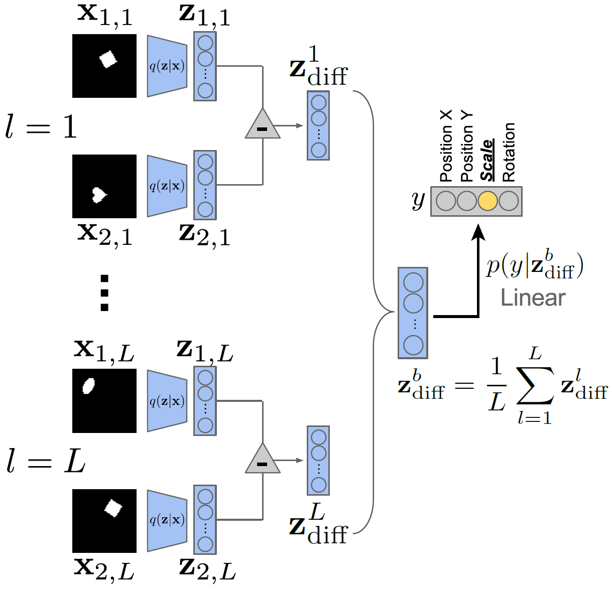
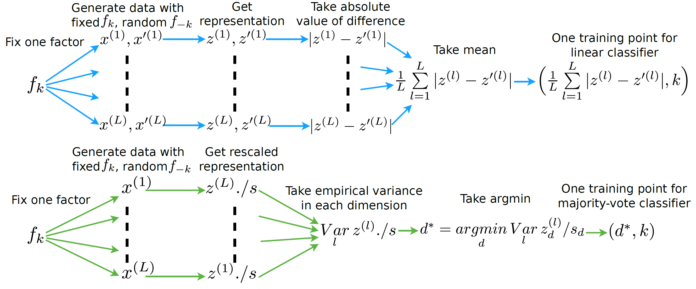

# Disentangled Representation Learning

General notations: $x$ denotes data points (generated by $K$ factors), $y$ denotes labels, $z$ denotes $D$-dimensional representation.

## What makes a good representation?

> Adapted from S. Soatto's IPAM talk, 2018[^1].

- Sufficiency: $I(y;z) = I(y;x)$
- Invariance: $n \perp y \rightarrow I(n;z) = 0$, where $n$ denotes nuisance factors.
- Minimality: $\min I(x; z)$
- Disentangling: $\mathrm{TC}(z): \mathcal{D}_{\mathrm{KL}}(p(z) \Vert \prod_i p(z_i))$

**Invariance $\Leftrightarrow$ Minimality $|$ Sufficiency** &emsp; If $z$ is sufficient, $n$ is a nuisance, then

$$
\DeclareMathOperator{\Dcal}{\mathcal{D}}
\DeclareMathOperator{\Xcal}{\mathcal{X}}
\DeclareMathOperator{\E}{\mathbb{E}}
\DeclareMathOperator{\R}{\mathbb{R}}
\DeclareMathOperator{\dom}{\mathrm{dom}}
\DeclareMathOperator{\sign}{\mathrm{sign}}
\DeclareMathOperator{\argmax}{\mathrm{argmax}}
\DeclareMathOperator{\KL}{\Dcal_{\mathrm{KL}}}
\DeclareMathOperator{\JS}{\Dcal_{\mathrm{JS}}}
\def\dd{\mathrm{d}}
\def\ee{\mathrm{e}}
\def\xbf{\mathbf{x}}
\def\wbf{\mathbf{w}}
\def\vbf{\mathbf{v}}
\def\zbf{\mathbf{z}}
I(z;n) \le I(z;x) - I(x;y)
$$

and there exists a nuisance for which equality holds.

### Merits of Disentangled Representation

While there is no widely-accepted formalized notion of disentanglement (yet), the key intuition is that a disentangled representation should separate the distinct, informative factors of variations in the data[^3].

Disentangled representations offer several advantages[^9]:

- Invariance: it is easier to derive representations that are invariant to nuisance factors by simply marginalizing over the corresponding dimensions
- Transferability: they are arguably more suitable for transfer learning as most of the key underlying generative factors appear segregated along feature dimensions
- Interpretability: a human expert may be able to assign meanings to the dimensions
- Conditioning and intervention: they allow for interpretable conditioning and/or intervention over a subset of the latents and observe the effects on other nodes in the graph.

Current deep learning common practices are generally not disentangled, for instance, state-of-the-art deep learning models trained on speech data failed to capture basic conceps such as distributions on phonemes[^8].

## Metrics of disentanglement

> Adapted from a benchmark paper by F. Locatello et al.[^2].

### $\beta$-VAE

The $\beta$-VAE metric[^4] measures disentanglement as the accuracy of a linear classifier that predicts the index of a fixed factor of variation.

{: style="width: 60%" .image-center }

Over a batch of $L$ samples, each pair of data points has a fixed value for one target generative factor $y$ (here $y$ is scale) and differs on all others. A linear classifier is then trained to identify the target factor using the average pairwise difference $\zbf^b_{\mathrm{diff}}$ in the latent space over $L$ samples.

This metric has several drawbacks as pointed out by follow-up works[^5],[^6]:

- It is sensitive to hyperparameters of the linear classifier optimization
- Classifying data-generating factors is not intuitive because factors can be represented as a linear combination of multiple independent latent dimensions[^5]. Contrary to this point, [^6] believes a truly disentangled model should only contain one latent variable related to each factor, and argues that this metric lacks axis-alignment detection.
- It has a failure mode: when $K-1$ out of $K$ factors are disentangled, it outputs 100%.

### FactorVAE

The FactorVAE metric[^5] uses a majority vote classifier on a different feature vector, namely, the argmin of the per-dimension empirical variance.

### Mutual Information Gap (MIG)

Mutual Information Gap (MIG)[^6] measures for each factor of variation the normalized gap in mutual information between the highest and second highest coordinate in $z$.

$$
\mathrm{MIG} = \frac{1}{K} \sum_{k=1}^K \frac{1}{H(v_k)} \Big(
    I_n(z_{j^{(k)}}; v_k) - \max_{j \ne j^{(k)}} I_n(z_{j}; v_k)
\Big)
$$

where $j^{(k)} = \argmax_j I_n(z_j;v_k)$. MIG is bounded by 0 and 1.

**Estimation of $I_n(z_j;v_k)$** &emsp; Let $n \in \{1, 2, \dots, N\}$ be the data point index and $\Xcal_{v_k}$ be the support of $p(n|v_k)$. We make the following assumptions:

- Model: $q(z, v) = \sum_x p(v)p(x|v)q(z|x)$.
- The inference distribution $q(z_j|x)$ can be sampled from and is known for all $j$.
- The generating process $p(n|v_k)$ can be sampled from and is known.
- Simplifying assumption: $p(v_k)$ and $p(n|vk)$ are quantized.

Then the mutual information can be estimated as the following:

$$
\begin{align}
 & I_n(z_j;v_k) \\
=& \E_{q(z_j, v_k)} \left( \log \sum_{n=1}^N q(z_j, v_k, n) - \log q(z_j) - \log p(v_k) \right) \\
=& \E_{p(v_k)p(n^\prime|v_k)q(z_j|n^\prime)} \left( \log \sum_{n=1}^N p(v_k)p(n|v_k)q(z_j|n) - \log q(z_j) - \log p(v_k) \right) \\
=& \E_{p(v_k)p(n^\prime|v_k)q(z_j|n^\prime)} \left( \log \sum_{n=1}^N p(n|v_k)q(z_j|n) \right) H(z_j) \\
=& \E_{p(v_k)p(n^\prime|v_k)q(z_j|n^\prime)} \left( \log \sum_{n \in \Xcal_{v_k}} p(n|v_k)q(z_j|n) \right) H(z_j) \\
\end{align}
$$

### Modularity
Modularity (Ridgeway & Mozer, 2018) measures if each dimension of $z$ depends on at most a factor of variation using their mutual information.

## VAE-based

[^1]: A. Achille; S. Soatto, Emergence of Invariance and Disentanglement in Deep Representations, JMLR 2018. [paper](https://arxiv.org/pdf/1706.01350.pdf) [talk](https://www.youtube.com/watch?v=zbg49SMP5kY)
[^2]: F. Locatello et al., Challenging Common Assumptions in the Unsupervised Learning of Disentangled Representations, ICLR 2019. [paper](https://arxiv.org/abs/1811.12359) [blog](https://ai.googleblog.com/2019/04/evaluating-unsupervised-learning-of.html) [code](https://github.com/google-research/disentanglement_lib)
[^3]: Y. Bengio; A. Courville; P. Vincent, [Representation Learning: A Review and New Perspectives](https://arxiv.org/abs/1206.5538), IEEE-PAMI 2013.
[^4]: I. Higgins et al., [β-VAE - Learning Basic Visual Concepts with a Constrained Variational Framework](https://openreview.net/pdf?id=Sy2fzU9gl), ICLR 2017.
[^5]: H. Kim; A. Mnih, [Disentangling by Factorising](https://arxiv.org/abs/1802.05983), NeurIPS 2017.
[^6]: T. Q. Chen et al., [Isolating Sources of Disentanglement in VAEs](https://arxiv.org/abs/1802.04942), NeurIPS 2018.
[^7]: K. Ridgeway; M. C. Mozer, [Learning Deep Disentangled Embeddings With the F-Statistic Loss](https://papers.nips.cc/paper/7303-learning-deep-disentangled-embeddings-with-the-f-statistic-loss.pdf), NeurIPS 2018.
[^8]: Y. Bengio, [From Deep Learning of Disentangled Representations to Higher-level Cognition](https://www.youtube.com/watch?v=Yr1mOzC93xs), MSR AI Distinguished Lectures and Fireside Chats, 2018.
[^9]: A. Kumar; P. Sattigeri; A. Balakrishnan, [Variational Inference of Disentangled Latent Concepts from Unlabeled Observations](https://arxiv.org/abs/1802.05983), ICLR 2018.
