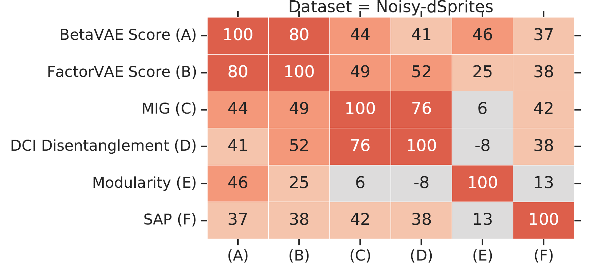
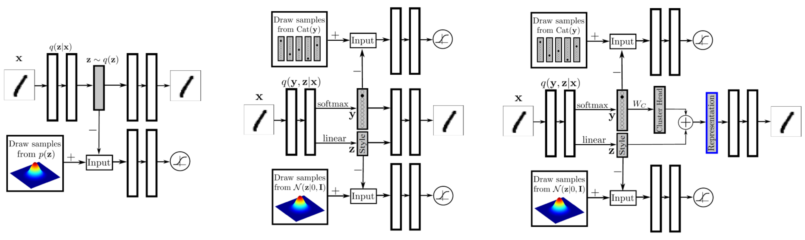
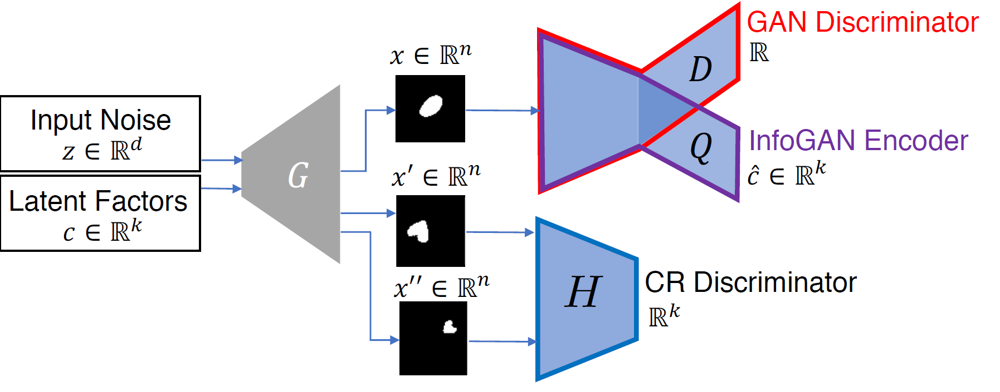
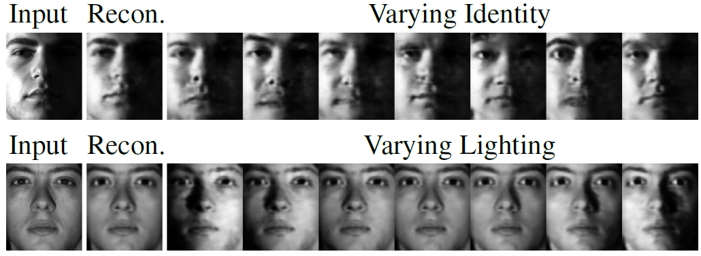
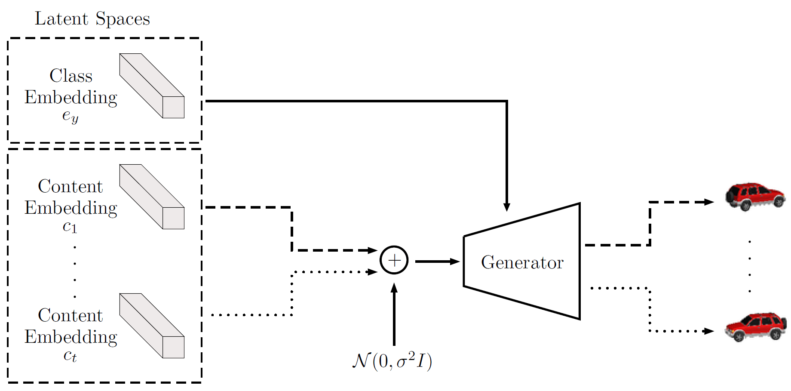
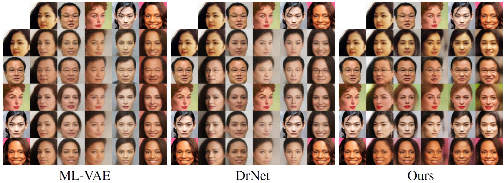
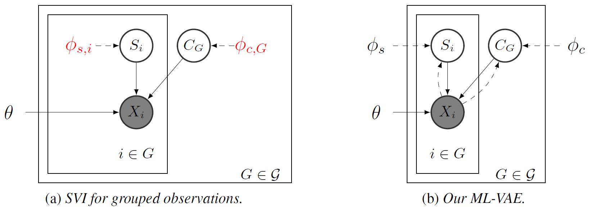
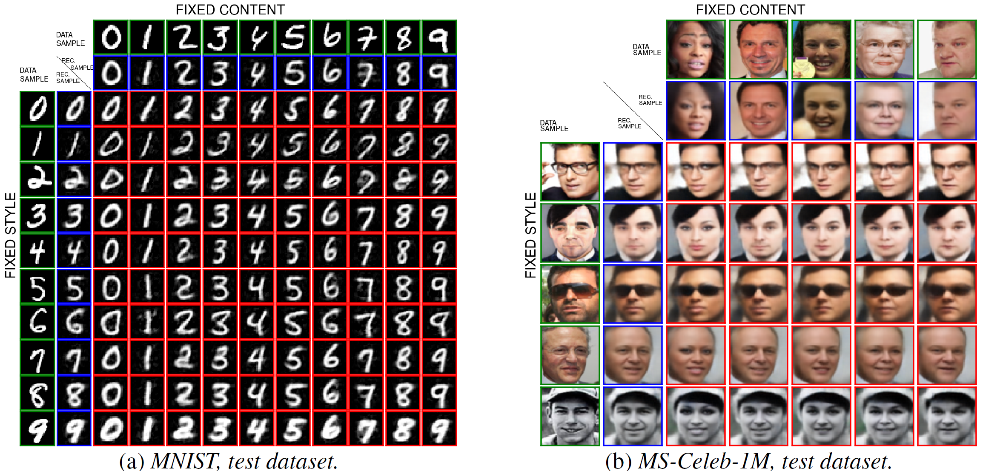

# Disentangled Representation Learning

General notations: $x$ denotes data points (generated by $K$ factors), $y$ denotes labels, $z$ denotes $D$-dimensional representation.

## What makes a good representation?

> Adapted from S. Soatto's IPAM talk, 2018[^1].

- Sufficiency: $I(y;z) = I(y;x)$
- Invariance: $n \perp y \rightarrow I(n;z) = 0$, where $n$ denotes nuisance factors.
- Minimality: $\min I(x; z)$
- Disentangling: $\mathrm{TC}(z): \mathcal{D}_{\mathrm{KL}}(p(z) \Vert \prod_i p(z_i))$

**Invariance $\Leftrightarrow$ Minimality $|$ Sufficiency** &emsp; If $z$ is sufficient, $n$ is a nuisance, then

$$
\DeclareMathOperator{\Dcal}{\mathcal{D}}
\DeclareMathOperator{\Dsup}{\Dcal^{\mathrm{sup}}}
\DeclareMathOperator{\Lcal}{\mathcal{L}}
\DeclareMathOperator{\Bcal}{\mathcal{B}}
\DeclareMathOperator{\Ncal}{\mathcal{N}}
\DeclareMathOperator{\Gcal}{\mathcal{G}}
\DeclareMathOperator{\Xcal}{\mathcal{X}}
\DeclareMathOperator{\Zcal}{\mathcal{Z}}
\DeclareMathOperator{\ELBO}{\mathrm{ELBO}}
\DeclareMathOperator{\E}{\mathbb{E}}
\DeclareMathOperator{\R}{\mathbb{R}}
\DeclareMathOperator{\Cov}{\mathrm{Cov}}
\DeclareMathOperator{\Var}{\mathrm{Var}}
\DeclareMathOperator{\dom}{\mathrm{dom}}
\DeclareMathOperator{\sign}{\mathrm{sign}}
\DeclareMathOperator{\diag}{\mathrm{diag}}
\DeclareMathOperator{\argmax}{\mathrm{argmax}}
\DeclareMathOperator{\KL}{\Dcal_{\mathrm{KL}}}
\DeclareMathOperator{\MMD}{\Dcal_{\mathrm{MMD}}}
\DeclareMathOperator{\JS}{\Dcal_{\mathrm{JS}}}
\DeclareMathOperator{\stopgradient}{\mathrm{StopGradient}}
\def\dd{\mathrm{d}}
\def\ee{\mathrm{e}}
\def\xbf{\mathbf{x}}
\def\Xbf{\mathbf{X}}
\def\ybf{\mathbf{y}}
\def\sbf{\mathbf{s}}
\def\wbf{\mathbf{w}}
\def\vbf{\mathbf{v}}
\def\zbf{\mathbf{z}}
\def\cbf{\mathbf{c}}
\def\dd{\mathrm{d}}
I(z;n) \le I(z;x) - I(x;y)
$$

and there exists a nuisance for which equality holds.

### Merits of Disentangled Representation

While there is no widely-accepted formalized notion of disentanglement (yet), the key intuition is that a disentangled representation should separate the distinct, informative factors of variations in the data[^3].

Disentangled representations offer several advantages[^9]:

- **Invariance**: it is easier to derive representations that are invariant to nuisance factors by simply marginalizing over the corresponding dimensions
- **Transferability**: they are arguably more suitable for transfer learning as most of the key underlying generative factors appear segregated along feature dimensions
- **Interpretability**: a human expert may be able to assign meanings to the dimensions
- **Conditioning and intervention**: they allow for interpretable conditioning and/or intervention over a subset of the latents and observe the effects on other nodes in the graph.

Current deep learning common practices are generally not disentangled, for instance, state-of-the-art deep learning models trained on speech data failed to capture basic conceps such as distributions on phonemes[^8] (which could be discovered by a simple unsupervised clustering algorithm such as $k$-means), since phoneme information account for only a few bits per second and is easily overwhelmed by other variables.

## Metrics of disentanglement

> Adapted from the benchmark paper by F. Locatello et al.[^2], 2019.

This section discusses the metrics of disentanglement. Readers interested only in learning disentangled representation can skip this section.

### $\beta$-VAE Metric

The $\beta$-VAE metric[^4] measures disentanglement as the accuracy of a linear classifier that predicts the index of a fixed factor of variation.

{: style="width: 60%" .image-center }

Over a batch of $L$ samples, each pair of data points has a fixed value for one target generative factor $y$ (here $y$ is scale) and differs on all others. A linear classifier is then trained to identify the target factor using the average pairwise difference $\zbf^b_{\mathrm{diff}}$ in the latent space over $L$ samples.

This metric has several drawbacks as pointed out by follow-up works[^5],[^6]:

- It is sensitive to hyperparameters of the linear classifier optimization
- Classifying data-generating factors is not intuitive because factors can be represented as a linear combination of multiple independent latent dimensions[^5]. Contrary to this point, [^6] believes a truly disentangled model should only contain one latent variable related to each factor, and argues that this metric lacks axis-alignment detection.
- It has a failure mode: when $K-1$ out of $K$ factors are disentangled, it outputs 100%.

### FactorVAE Metric

The FactorVAE metric[^5] uses a majority vote classifier on a different feature vector, namely, the argmin of the per-dimension empirical variance.

### Mutual Information Gap (MIG)

Mutual Information Gap (MIG)[^6] measures for each factor of variation the normalized gap in mutual information between the highest and second highest coordinate in $z$.

$$
\mathrm{MIG} = \frac{1}{K} \sum_{k=1}^K \frac{1}{H(v_k)} \Big(
    I_n(z_{j^{(k)}}; v_k) - \max_{j \ne j^{(k)}} I_n(z_{j}; v_k)
\Big)
$$

where $j^{(k)} = \argmax_j I_n(z_j;v_k)$. MIG is bounded by 0 and 1.

**Estimation of $I_n(z_j;v_k)$** &emsp; Let $n \in \{1, 2, \dots, N\}$ be the data point index and $\Xcal_{v_k}$ be the support of $p(n|v_k)$. We make the following assumptions:

- Model: $q(z, v) = \sum_x p(v)p(x|v)q(z|x)$.
- The inference distribution $q(z_j|x)$ can be sampled from and is known for all $j$.
- The generating process $p(n|v_k)$ can be sampled from and is known.
- Simplifying assumption: $p(v_k)$ and $p(n|v_k)$ are quantized.

Then the mutual information can be estimated as the following:

$$
\begin{align}
 & I_n(z_j;v_k) \\
=& \E_{q(z_j, v_k)} \left( \log \sum_{n=1}^N q(z_j, v_k, n) - \log q(z_j) - \log p(v_k) \right) \\
=& \E_{p(v_k)p(n^\prime|v_k)q(z_j|n^\prime)} \left( \log \sum_{n=1}^N p(v_k)p(n|v_k)q(z_j|n) - \log q(z_j) - \log p(v_k) \right) \\
=& \E_{p(v_k)p(n^\prime|v_k)q(z_j|n^\prime)} \left( \log \sum_{n=1}^N p(n|v_k)q(z_j|n) \right) H(z_j) \\
=& \E_{p(v_k)p(n^\prime|v_k)q(z_j|n^\prime)} \left( \log \sum_{n \in \Xcal_{v_k}} p(n|v_k)q(z_j|n) \right) H(z_j) \\
\end{align}
$$

### Modularity & Explicitness
**Background: An Explicit Definition of Disentanglement**

In the paper[^7], the authors first give an explicit definition of Disentanglement:

- *Modular*: each dimension of the representation conveys information about at most one factor
- *Compact*: a given factor is associated with only one or a few dimensions in the representation
- *Explicit*: there is a simple (e.g., linear) mapping from the representation to the value of a factor

They use this definition to analyse the [$\beta$-VAE Metric](#beta-vae-metric) and the [FactorVAE Metric](#factorvae-metric), and found that the former consider only modularity, while the latter consider modularity and compactness. They argue that compactness is not a desiderata for disentangled representation learning since

- Forcing compactness can affect the representation’s utility, e.g. $(\sin \theta, \cos \theta)$ vs $\theta$.
- Compactness requirement highly constrain the solution space, while allowing redundancy enables many equivalent solutions.

Based on these claims, the authors quantify modularity and explicitness in their metric.

**The Modularity Metric**

Note that for ideally modular representation, each latent dimension would have high mutual information with a single factor. Let $m_{jk} = I(z_j;v_k)$ and $\theta_j = \max_k m_{jk}$. Define a template vector $\mathbf{t}_j$ such that 

$$
t_{jk} = \begin{cases}
\theta_j & \text{if }k=\argmax_{k^\prime} m_{jk^\prime}\\
0        & \text{otherwise}
\end{cases}
$$
The observed deviation from the template is given by

$$
\delta_j = \frac{\sum_k (m_{jk} - t_{jk})^2}{\theta_j^2(K-1)}
$$

A deviation of 0 indicates perfect modularity and 1 indicates that the $j$-th dimension has equal mutual information with every factor.

Thus, they use $1 - \delta_j$ as a modularity score for latent dimension $j$ and the mean over $j$ as the modularity score for the representation.

**The Explicitness Metric**

For explicitness, the author fit a one-versus-rest logistic-regression classifier that takes the entire representation as input, and record the area under the ROC curve (AUROC) of that classifier. The explicitness score is defined as the mean of AUROC over all $K$ factors and all possible values of the factors.

### DCI Disentanglement Score

The DCI Disentanglement Metric[^10] computes the entropy of the normalized importance of each latent dimension $j$ for predicting the value of a factor of variation $v_k$. The metric is calculated as follows:

- Train $K$ regressors to predict data-generating factors $v_k$ given latent representation $z$.
- Construct a matrix $R$ of relative importance  where $R_{jk}$ denotes the relative importance (e.g. absolute value of the LASSO weight) of $z_j$ in predicting $v_k$.
- Devide $R$ by its row-wise sum to obtain normalized importance $P$, where $P_{jk} = \frac{R_{jk}}{\sum_{k^\prime} R_{jk}}$. Note that the "disentanglement" here is equivalent to the "modularity" in the [Modularity & Explicitness Metric](#modularity--explicitness).
- Calculate the entropy of the normalized importance $H(P_j) = -\sum_{k=1}^K P_{jk}\log P_{jk}$ for each latent dimension $j$.
- Obtain the DCI Disentanglement Metric by weighted average of per-dimension disentanglement $D = \sum_j \rho_j (1-H(P_j))$, where $\rho_j = \frac{\sum_k R_{jk}}{\sum_{jk}R_{jk}}$.

### SAP Score
The SAP Score[^9] is the average difference of the prediction error of the two most predictive latent dimensions for each factor. The metric is calculated as follows:

- Train $K$ regressors/classifiers to predict data-generating factors $v_k$ given the $j$-th latent dimension $z_j$.
- Construct a score matrix $R$ where $S_{jk}$ denotes the relative importance (specifically, $R^2$ score for linear regression and balanced classification accuracy for thresholded classification) of $z_j$ in predicting $v_k$. For inactive (low varince) dimensions we take $S_{jk}$ to be zero for all $k$s.
- For each factor $k$, take the difference of top two entries of vector $S_{\cdot k}$.
- Obtain the SAP score as the mean of these differences over all factors.

Note that SAP focuses on compactness, and thus a high SAP score does not rule out not-modular representations (one latent dimension capturing two or more generative factors well). Further, a low SAP score does not rule out good modularity in cases when two (or more) latent dimensions might be correlated strongly with the same generative factor and poorly with other generative factors.

### Metric Agreement
{: style="width: 70%" .image-center }
Taken from the benchmark paper[^2].

The authors observe that all metrics except [Modularity](#modularity--explicitness) seem to be correlated strongly on the datasets dSprites, Color-dSprites and Scream-dSprites and mildly on the other data sets. There appear to be two pairs among these metrics that capture particularly similar notions: the [$\beta$-VAE](#beta-vae-metric) and the [FactorVAE](#factorvae-metric) metric as well as the [MIG](#mutual-information-gap-mig) and [DCI Disentanglement](#dci-disentanglement-score).

## Unsupervised Disentanglement

### Constraining the VAE Bottleneck Capacity

#### $\beta$-VAE

The $\beta$-VAE[^4] introduces a hyperparameter $\beta$ in front of the KL regularizer of the VAE ELBO to constrain the capacity of the VAE bottleneck. By setting $\beta > 1$, the encoder distribution will be forced to better match the factorized unit Gaussian prior. This often results in decreased reconstruction capabilities.

$$
\E_{p(\xbf)} \left[
    \E_{q_\phi(\zbf|\xbf)}\log p_\theta(\xbf|\zbf) - \beta \KL(q_\phi(\zbf|\xbf) \Vert p(\zbf))
\right]
$$

#### AnnealedVAE

In a follow-up work[^11], the authors propose to progressively increase the bottleneck capacity, so that the encoder can focus on learning one factor of variation at the time and eventually capture more factors of variations than $\beta$-VAE:

$$
\E_{p(\xbf)} \left[
    \E_{q_\phi(\zbf|\xbf)}\log p_\theta(\xbf|\zbf) - \gamma |\KL(q_\phi(\zbf|\xbf) \Vert p(\zbf)) - C|
\right]
$$

where $C$ is annealed from zero to some value large enough to produce good representation.

### Penalizing the total correlation

Note that the KL regularizer term can be rewritten as

$$
\begin{align}
 & \E_{p(\xbf)} \KL(q_\phi(\zbf|\xbf) \Vert p(\zbf)) \\
=& \E_{q(\zbf, \xbf)} \log \left( \frac{q(\zbf|\xbf)}{p(\zbf)}\frac{q(\zbf)}{q(\zbf)} \right) \\
=& \E_{q(\zbf, \xbf)} \log \frac{q(\zbf|\xbf)}{q(\zbf)} + \E_{q(\zbf)} \log \frac{q(\zbf)}{p(\zbf)} \\
=& I_q(\xbf; \zbf) + \KL(q(\zbf) \Vert p(\zbf)) \\
=& I_q(\xbf; \zbf) + \E_{q(\zbf)} \log \left( \frac{q(\zbf)}{\prod_j p(z_j)} \frac{\prod_j q(z_j)}{\prod_j q(z_j)} \right) \\
=& I_q(\xbf; \zbf) + \KL(q(\zbf) \Vert \prod_j(q(z_j))) + \sum_j\KL(q(z_j) \Vert p(z_j))
\end{align}
$$

where $q(\zbf) = \sum_\xbf p(\xbf) q(\zbf|\xbf)$ is the aggregated posterior. Kim and Minh [^5] argues that penalizing $I_q(\xbf; \zbf)$ is neither necessary nor desirable for disentanglement. Instead, they opt to minimize the *total correlation* of $q(\zbf)$ (the second term in the last line of above equation), yielding the following objective:

$$
\E_{p(\xbf)} \left[
    \E_{q_\phi(\zbf|\xbf)}\log p_\theta(\xbf|\zbf) - \KL(q_\phi(\zbf|\xbf) \Vert p(\zbf))
\right] - \gamma \KL(q(\zbf) \Vert \prod_j q(z_j))
$$

#### FactorVAE

Kim and Minh [^5] propose to estimate the total correlation using the density ratio trick, i.e. train an additional classifier $D$ to predict if the latent comes from $q(\zbf)$ or $\prod_j q(z_j)$. Latent samples from $\prod_j q(z_j)$ are obtained by randomly permuting the dimensions within latents inferred in a minibatch.

#### $\beta$-TCVAE

$\beta$-TCVAE optimizes the same objective as FactorVAE, but uses a tractable biased Monte-Carlo estimate for the total correlation. Let $\Bcal_M = (\xbf_1, \dots, \xbf_M)$ be a minibatch of size $M$ sampled i.i.d. from the training set of size $N$. Therefore, $p(\Bcal_M) = (\frac{1}{N})^M$. Let $r(\Bcal_M|n)$ denote the probability of a sampled minibatch where one of the elements is fixed to be index $n$, thus $p(r(\Bcal_M|n)) = (\frac{1}{N})^{M-1}$. Then

$$
\begin{align}
 & \E_{q(\zbf)} \log q(\zbf) \\
=& \E_{q(\zbf, n)} \log \E_{p(\Bcal_M)} \left[\frac{1}{M} \sum_{m=1}^M q(\zbf | n_m) \right] \\
\ge& \E_{q(\zbf, n)} \log \E_{r(\Bcal_M|n)} \left[ \frac{p(\Bcal_M)}{r(\Bcal_M|n)}\frac{1}{M} \sum_{m=1}^M q(\zbf | n_m) \right] \\
=& \E_{q(\zbf, n)} \log \E_{r(\Bcal_M|n)} \left[ \frac{1}{MN} \sum_{m=1}^M q(\zbf | n_m) \right] \\
\approx& \frac{1}{M} \sum_{i=1}^M \left[ \log \frac{1}{NM} \sum_{m=1}^M q(\zbf | n_m) \right]
\end{align}
$$

The inequality is due to $r$ having a support that is a subset of that of $p$. $\E_{q(z_j)} \log q(z_j)$ is estimated in the same way.

### Disentangling the Inferred Prior (Aggregated Posterior)

The authors of [^9] argue that a disentangled generative model requires a disentangled inferred prior (aggregated posterior) $q(\zbf)$. They propose to optimize

$$
\E_{p(\xbf)} \left[
    \E_{q_\phi(\zbf|\xbf)}\log p_\theta(\xbf|\zbf) - \KL(q_\phi(\zbf|\xbf) \Vert p(\zbf))
\right] - \lambda \Dcal(q(\zbf) \Vert p(\zbf))
$$

where $\Dcal$ is some arbitrary divergence. Since the additional term is intractable, we could either use [variational formulation of KL-divergence](../representation_learning_with_mutual_information_maximization/#variational-representation-of-the-f-divergence) as in Adversarial AutoEncoeders (AAEs)[^12] or simply perform moment matching as in DIP-VAE[^9].

#### DIP-VAE

DIP-VAE[^9] proposes to match the covariance of $q(\zbf)$ and $p(\zbf)$. This amounts to decorrelating the dimensions of $\zbf \sim q_\phi(\zbf)$ if $p(\zbf) = \Ncal(0, I)$. By [the law of covariance](https://en.wikipedia.org/wiki/Law_of_total_covariance), the covariance of $\zbf \sim q(\zbf)$ is given by

$$
\Cov_{q_\phi(\zbf)}\zbf = \E_{p(\xbf)} \Cov_{q_\phi(\zbf|\xbf)}\zbf + \Cov_{p(\xbf)} \E_{q_\phi(\zbf|\xbf)}\zbf
$$

where $\E_{q_\phi(\zbf|\xbf)}\zbf$ and $\Cov_{q_phi(\zbf|\xbf)}\zbf$ are functions of the random variable $\xbf$ ($\zbf$ is marginalized over). For VAE models with Gaussian posterior of $\zbf$, i.e. $q_\phi(\zbf, \xbf) = \Ncal(\mu_\phi(\xbf), \Sigma_\phi(\xbf))$, the covariance of $\zbf \sim q(\zbf)$ reduces to

$$
\Cov_{q_\phi(\zbf)}\zbf = \E_{p(\xbf)} \Sigma_\phi(\xbf) + \Cov_{p(\xbf)} \mu_\phi(\xbf)
$$

which we want to be close to the identity matrix. We choose entry-wise squared $l_2$-norm as the measure of proximity.

Further, $\Sigma_\phi(\xbf)$ is often taken as diagonal, which means that cross-correlations (off-diagonals) between the latents are due to only $\Cov_{p(\xbf)} \mu_\phi(\xbf)$. This suggests two possible options for the disentangling regularizer:

- **DIP-VAE-I** &emsp; Regularizing only $\Cov_{p(\xbf)} \mu_\phi(\xbf)$. The objective becomes
 
$$
\max_{\theta, \phi} \ELBO(\theta, \phi) - \lambda_1 \sum_{i \ne j} \left[\Cov_{p(\xbf)\mu_{\phi}(\xbf)}\right]^2_{ij} - \lambda_2 \sum_i \left(\left[\Cov_{p(\xbf)} \mu_\phi(\xbf)\right]_{ii} - 1\right)^2
$$

- **DIP-VAE-II** &emsp; Regularizing $\Cov_{q_\phi(\zbf)}\zbf$. The objective is

$$
\max_{\theta, \phi} \ELBO(\theta, \phi) - \lambda_1 \sum_{i \ne j} \left[\Cov_{q_\phi(\zbf)}\zbf\right]^2_{ij} - \lambda_2 \sum_i \left(\left[\Cov_{q_\phi(\zbf)}\zbf\right]_{ii} - 1\right)^2
$$

The authors argue that in datasets where the number of generative factors is less than the latent dimension, DIP-VAE-II is more suitable than DIP-VAE-I as keeping all dimensions active (optimizing towards $\Var_{q_\phi(\zbf)}z_i=1$ for all $i$'s) might result in splitting of an attribute across multiple dimensions, hurting the goal of disentanglement.

#### AAE
Adversarial autoencoders[^12] attaches an adversarial discriminator on top of the latent representation of an autoencoder to match the aggregated posterior $q(\zbf)$ to an arbitrary easy-to-sample prior $p(\zbf)$.

The network is trained jointly in two phases:

1. In the *reconstruction* phase, the autoencoder minimizes the reconstruction error of the inputs.
2. In the *regularization* phase, the discriminator is first updated to tell apart the true samples (generated using the prior) from the generated samples (the hidden codes computed by the encoder). Then the encoder is updated to confuse the discriminator.

AAE has many variants aimed for different learning settings. (left) Adversarial Autoencoders; (middle) Semi-supervised AAE; (right) AAE for Dimensionality Reduction.

- **Semi-supervised AAE** has two adversarial discriminator: one for label $y$ and another for style representation $\zbf$.
    1. In the *reconstruction* phase, the autoencoder minimize the reconstruction error of the inputs on an unlabeled mini-batch.
    2. In the *regularization* phase, each of the discriminators is updated to tell apart the true samples (generated using the Categorical and Gaussian priors) from the generated samples (the hidden codes computed by the encoder). Then the encoders are updated to confuse their discriminators.
    3. In the *classification* phase, the encoder is updated to minimize the cross-entropy cost on a labeled mini-batch.
- **AAE for Unsupervised Clustering** has the same architecture as the Semi-supervised AAE, while it does not have the classification phase.
- **AAE for Dimensionality Reduction** aims to learn a good representation that encodes both the label and style information. The final representation is achieved by adding the distributed representation of the cluster head with the style representation, both $n$-dimensional. The cluster head representation is obtained by multiplying the $m$ dimensional one-hot class label vector by an $m \times n$ matrix $W_C$. We introduce an additional cost function that linearly penalizes the Euclidean distance between every two cluster heads if they are greater than a threshold $\eta$.

#### InfoVAE

The InfoVAE paper[^13] points out that the amortized inference distribution $q_\phi(\zbf|\xbf)$ of VAEs might fail to approximate the true posterior $p_\theta(\zbf|\xbf)$ for two reasons:

- The ELBO can be maximized (even to infinity in extreme cases) with a very inaccurate variational posterior.
- Implicit modeling bias: common modeling choices (such as the high dimensionality of $\xbf$ compared to $\zbf$) tend to sacrifice variational inference for data fit when modeling capacity is not sufficient to achieve both.

Regardless of the cause, this is generally an undesirable phenomenon for two reasons:

- One may care about accurate inference (e.g. in representation learning) more than generating sharp samples.
- Overfitting: Because $p_{\mathrm{data}}$ is an empirical (finite) distribution in practice, matching it too closely can lead to poor generalization.

To remedy this issue, the authors propose an additional mutual information term between $\xbf$ and $\zbf$ under the joint "inference" distribution $q_\phi(\xbf, \zbf)$, which is very similar to the additional term in DIP-VAE discussed [above](#disentangle-the-inferred-prior).

$$
\begin{align}
&\Lcal_{\mathrm{InfoVAE}} \\
=& -\lambda\KL(q_\phi(\zbf) \Vert p(\zbf)) - \E_{q(\zbf)}\left[ \KL(q_\phi(\xbf|\zbf) \Vert p_\theta(\xbf|\zbf)) \right] + \alpha I_q(\xbf;\zbf)\\
=& \E_{p(\xbf)} \left[
    \E_{q_\phi(\zbf|\xbf)}\log p_\theta(\xbf|\zbf) - (1 - \alpha) \KL(q_\phi(\zbf|\xbf) \Vert p(\zbf))
\right] - (\alpha + \lambda - 1) \KL(q_\phi(\zbf) \Vert p(\zbf))
\end{align}
$$

We can easily see that [$\beta$-VAE](#beta-vae) ($\lambda > 0$ and $\alpha = 1 - \lambda$) and [AAE](#aae) ($\alpha = \lambda = 1$, Use Jenson-Shannon Divergence to approximate $\KL(q(\zbf) \Vert p(\zbf))$) belongs to this framework. If we relax the last KL term to any strict divergence (strict as in $\Dcal(q\Vert p) = 0$ iff $q = p$), we can get three categories of InfoVAE:

- **Adversarial Training** as discussed in [AAE](#aae).
- **Stein Variational Gradient[^14]** aims to find the steepest direction $\phi_{q,p}$ that transforms $q(\zbf)$ towards $p(\zbf)$. For a small step size $\epsilon$, the transformation $T(\zbf)$ is defined as $T(\zbf) = z + \epsilon \phi_{q,p}(\zbf)$. The $\phi^\star$ that minimizes $\KL(T(\zbf) \Vert p(\zbf))$ is
    $$
    \phi_{q,p}^\star(\cdot) = \E_{q(\zbf)} \left[ k(\zbf,\cdot)\nabla_\zbf \log p(\zbf) + \nabla_\zbf k(\zbf,\cdot) \right]
    $$
    where $k$ is a positive definite kernel function. In practice we use minibatches to estimate the Stein gradients and use the surrogate loss $\widehat{\Dcal}(q_\phi(\zbf) \Vert p(\zbf)) = z^\top \stopgradient(\phi^\star_{q_\phi, p}(\zbf))$
- **Maximum-Mean Discrepancy** is a framework to quantify the distance between two distributions by comparing all of their moments. It can be efficiently implemented using the kernel trick. Letting $k(\cdot, \cdot)$ be any positive definite kernel, the MMD between $p$ and $q$ is
    $$
    \MMD(q \Vert p) = \E_{p(\zbf), p(\zbf^\prime)} k(\zbf,\zbf^\prime) - 2\E_{q(\zbf), p(\zbf^\prime)} k(\zbf,\zbf^\prime) + \E_{q(\zbf), q(\zbf^\prime)} k(\zbf,\zbf^\prime)
    $$
    $\MMD(q \Vert p)$ if and only if $p = q$.

The authors empirically shows that the MMD variant perform on-par or better than the other two in terms of distance between the aggregated posterior $q_\phi(\zbf)$ and the prior $p(\zbf)$, distance between sample label distribution (obtained by a pretrained classifier) and the true label distribution, training speed and stablity, semi-supervised learning on 1k labeled data.

### Maximizing MI b/t Latent Code and GAN Samples

Generative Adversarial Networks (GANs) are usually not used for representation learning since it does not have an encoder. But if one wants to generate samples in an interpretable and disentangled way, InfoGAN is one option.

#### InfoGAN

InfoGAN[^15] splits the latent vector of GAN into two parts: the incompressible noise $\zbf$, and the latent code $\cbf$ that target the salient structured semantic features of the data distribution. In its simplest form, we may assume a factored distribution for $\cbf$, given by $P(\cbf) = \prod_{i=1}^K P(c_i)$. To avoid the generator ignoring $\cbf$, a mutual information constraint is added between the latent code and the generated samples, making the overall objective ($Q$ will be introduced below)

$$
\min_{G,Q} \max_D \E_{\xbf \sim p_{\mathrm{data}}}\log D(\xbf) + \E_{[\zbf;\cbf] \sim p_{\mathrm{noise}}} \log (1 - D(G(\zbf, \cbf))) - \lambda I(\cbf, G(\zbf, \cbf))
$$

To maximize mutual information, the authors employ variational MI maximization.

$$
\begin{align}
&I(\cbf, G(\zbf, \cbf)) \\
=& H(\cbf) - H(\cbf|G(\zbf,\cbf)) \\
=& \E_{x \sim G(\zbf,\cbf)} \E_{\cbf^\prime \sim P(\cbf|\xbf)} \log P(\cbf^\prime|\xbf) + H(\cbf) \\
=& \E_{x \sim G(\zbf,\cbf)} \left[ \KL(P(\cdot|\xbf) \Vert Q(\cdot|\xbf)) + \E_{\cbf^\prime \sim P(\cbf|\xbf)} \log Q(\cbf^\prime|\xbf) \right] + H(\cbf) \\
\ge& \E_{x \sim G(\zbf,\cbf)} \E_{\cbf^\prime \sim P(\cbf|\xbf)} \log Q(\cbf^\prime|\xbf) + H(\cbf) \\
=& \E_{c \sim P(\cbf)} \E_{\xbf \sim G(\zbf, \cbf)} \log Q(\cbf|\xbf) + H(\cbf)
\end{align}
$$

For simplicity, the authors fix the latent code distribution and treat $H(\cbf)$ as a constant. Note that this variational objective $\Lcal_{\mathrm{Info}}(G, Q)$ is easy to approximate with Monte Carlo simulation. In particular, it can be maximized w.r.t. $Q$ directly and w.r.t. $G$ via the reparametrization trick.

From a representation learning perspective, $Q$ can be seen as an encoder. The discriminator $D$ and the encoder $Q$ share all convolutional layers and have separate fully-connected final layers. For categorical latent code $\cbf$, we use the natural choice of softmax nonlinearity to represent $Q(c_i|\xbf)$. For continuous latent code $\cbf$, there are more options depending on what is the true posterior $P(c_i |\xbf)$. The authors found that simply treating $Q(c_i |\xbf)$ as a factored Gaussian is sufficient.

Note that the InfoGAN-CR authors found[^16] that InfoGAN performance can be significantly improved with better architectural and hyperparameter choices.

#### InfoGAN-CR

InfoGAN-CR[^16] is inspired by the idea that disentanglement is characterized by distinct changes in the images when traversing the latent space. A constrastive regularizer (CR) is designed to encourage this behavior: Pairs of images $(x, x^\prime) \sim R^{(i)}$ are generated by fixing the $i$-th latent code $c_i$ and draw the rest of the latent codes with a controlled contrastive gap (details below). The authors propose to maximize the distinctness of this latent traversal with generalized Jensen-Shannon divergence among $R^{(i)}$'s

$$
\JS(R^{1}, \dots, R^{(K)}) = \frac{1}{K}\sum_{i \in [K]} \KL(R^{i} \Vert \bar{R})
$$

where $\bar{R} = \frac{1}{K}\sum_{j \in [K]} R^{(j)}$.

{: style="width: 70%" .image-center}

To implement the CR, the authors introduce a CR discriminator $H: \R^N \times \R^N \to \R^K$ that performs multi-way hypothesis testing, where $N$ is the input dimension and $K$ is the latent code dimension. The discriminator $H$ tries to identify which code $i$ was shared between the paired images. Both the generator $G$ and the discriminator $H$ try to make the $K$-way hypothesis testing successful. We add the following cross-entropy loss to the training objective

$$
\min_{G,H}\Lcal_{\mathrm{CR}}(G, H) = -\E_{i \sim \mathrm{U}([K]), (x, x^\prime) \sim R^{(i)}} \log H_i(x, x^\prime)
$$

The overall objective then becomes

$$
\min_{G, H, Q}\max_{D} \Lcal_{\mathrm{GAN}}(G, D) - \lambda\Lcal_{\mathrm{Info}}(G, Q) + \alpha \Lcal_{\mathrm{CR}}(G, H)
$$

**Justification of the CR implementation.** We can verify using Langrange's Multiplier that $H_i(x, x^\prime) = \frac{R^{(i)}(x, x^\prime)}{\sum_i R^{(i)}(x, x^\prime)}$ is a minimizer of $\Lcal_{\mathrm{CR}}$. The minimum loss is

$$
\begin{align}
&-\E_{i \sim \mathrm{U}([K]), (x, x^\prime) \sim R^{(i)}} \log H_i(x, x^\prime) \\
=& -\frac{1}{K} \sum_{i=1}^K \E_{(x, x^\prime) \in R^{(i)}} \log \frac{R^{(i)}(x, x^\prime)/K}{\sum_i R^{(i)}(x, x^\prime)/K} \\
=& \log K - \frac{1}{K} \sum_{i=1}^K \KL \left( R^{(i)} \Vert \bar{R} \right) \\
=& \log K - \JS(R^{(1)}, \dots, R^{(K)})
\end{align}
$$

**Progressive training.** The authors propose to progressively narrow the *contrastive gap*, defined as $\min_{j \in [K]\backslash{i}}|c_j - c_j^\prime|$, during training. This means the varying dimensions of the contrastive samples would get smaller and smaller variance, making them look like the fixed dimension $i$ more and more and thus result in more and more difficult prediction for $H$.

#### Elastic-InfoGAN

### Leveraging the Hierarchy of Latent Variables

#### StyleGAN

#### Very Deep VAE

## The Impossibility of Unsupervised Disentanglement

F. Locatello et al.[^2] showed that the unsupervised learning of disentangled representations is theoretically impossible from i.i.d. observations without inductive biases.
After observing $\xbf$, we can construct infinitely many generative models which have the same marginal distribution of $\xbf$.
Any one of these models could be the true causal generative model for the data, and the right model cannot be identified given only the distribution of $\xbf$.

## Learning from Partial Class Labels

### Latent Feature Discriminative Model (M1)

Proposed by D. P. Kingma et al.[^19].

1. Use VAE to learn an embedding space for all the training data.
2. Train a classifier (transductive SVM / multinomial regression) on the labeled data in the embedding space.

### Semi-Supervised VAE

#### M2

Proposed by D. P. Kingma et al.[^19]. The generative process is described as

$$
p(\ybf) = \mathrm{Cat}(\ybf|\pi) \qquad p(\zbf) = \Ncal(\zbf|\mathbf{0}, I) \qquad p_\theta(\xbf| \ybf, \zbf) = f_\theta(\xbf; \ybf, \zbf)
$$

The inference distribution is parameterized as

$$
q_\phi(\zbf|\ybf, \xbf) = \Ncal(\zbf | \mu_\phi(\ybf, \xbf), \diag(\sigma^2_\phi (\ybf, \xbf))) \qquad q_\phi(\ybf|\xbf) = \mathrm{Cat}(\ybf|\pi_\phi(\xbf))
$$

The learning objective is a weighted sum of the ELBO loss of $\log p_\theta(\xbf, \ybf)$, and the classification loss on $q_\phi(\ybf | \xbf)$. As this model is an instance of [the Generalized M2 model](#generalized-m2), we leave the detailed discussion below.

For a systematic benchmark of the performance of models combining M2 and the unsupervised VAE disentanglement methods discussed [above](#unsupervised-disentanglement), see[^21].

#### Generalized M2

N. Siddharth et al.[^17] focus on the setting where some factors $\ybf$ are interpretable and partly labeled. They generalize the M2 model to arbitrary conditional dependency structure. They first define an objective over $N$ unsupervised data points $\Dcal = \{\xbf^i\}_{i=1}^N$ and $M$ supervised data points $\Dsup = \{(\xbf^i, \ybf^i)\}_{i=1}^M$.

$$
\Lcal(\theta, \phi; \Dcal, \Dsup) = \sum_{i=1}^N \ELBO(\theta, \phi; \xbf^n) + \gamma \sum_{i=1}^M \Lcal_{\mathrm{sup}}(\theta, \phi; \xbf^m, \ybf^m)
$$

The supervised loss is the ELBO loss of $\log p_\theta(\xbf, \ybf)$, and the cross entropy loss encouraging accurate inference of $\ybf$.

$$
\Lcal_{\mathrm{sup}}(\theta, \phi; \xbf^m, \ybf^m) = \E_{q_\phi(\zbf|\xbf^m, \ybf^m)} \log \frac{p_\theta(\xbf^m, \ybf^m, \zbf)}{q_\phi(\zbf|\xbf^m,\ybf^m)} + \alpha\log q_\phi(\ybf^m|\xbf^m)
$$

**Calculating the supervised loss.** Note that this definition implicitly assumes that we can evaluate the conditional probability $q_\phi(\zbf | \xbf, \ybf)$ and the marginal $q_\phi(\ybf|\xbf) = \int q_\phi(\ybf, \zbf|\xbf) \dd \zbf$. This would be the case if we factor $q_\phi(\ybf, \zbf|\xbf)$ into $q_\phi(\zbf | \xbf, \ybf)q_\phi(\ybf|\xbf)$, as in [the M2 model](#m2-generative-semi-supervised-model). But if we have another conditional dependence structure such as $q_\phi(\ybf, \zbf|\xbf) = q_\phi(\ybf | \xbf, \zbf)q_\phi(\zbf|\xbf)$, we would run into the following difficulties:

1. Evaluating the density $q_\phi(\zbf|\xbf, \ybf) = \frac{q_\phi(\ybf, \zbf|\xbf)}{\int q_\phi(\ybf, \zbf|\xbf) \dd \zbf}$ becomes difficult
2. Generating samples, e.g. sampling from $q_\phi(\zbf|\xbf, \ybf)$ requires inference

We first re-express $\Lcal_{\mathrm{sup}}$ as follows, which alleviates (1.) by removing the need to evaluate $q_\phi(\zbf|\xbf, \ybf)$.
$$
\Lcal_{\mathrm{sup}}(\theta, \phi; \xbf^m, \ybf^m) = \E_{q_\phi(\zbf|\xbf^m, \ybf^m)} \log \frac{p_\theta(\xbf^m, \ybf^m, \zbf)}{q_\phi(\ybf^m,\zbf|\xbf^m)} + (1 + \alpha)\log q_\phi(\ybf^m|\xbf^m)
$$

We can then use *(self-normalised) importance sampling* to approximate the supervsied loss. Specifically, we sample *proposals* $\zbf^{m,s} \sim q_\phi(\zbf|\xbf^m)$ from the unconditioned encoder distribution and estimate the first supervised term as follows:

$$
\E_{q_\phi(\zbf|\xbf^m, \ybf^m)} \log \frac{p_\theta(\xbf^m, \ybf^m, \zbf)}{q_\phi(\ybf^m,\zbf|\xbf^m)} \approx \frac{1}{S}\sum_{s=1}^S \frac{w^{m,s}}{Z^m} \log \frac{p_\theta(\xbf^m, \ybf^m, \zbf)}{q_\phi(\ybf^m,\zbf|\xbf^m)}
$$

where the unnormalized weight $w^{m,s}$ and the normalizer $Z^m$ are defined as

$$
w^{m,s} = \frac{q_\phi(\ybf^m, \zbf^{m,s}|\xbf^m)}{q_\phi(\zbf^{m,s}|\xbf^m)} = q_\phi(\ybf^m|\zbf^{m,s},\xbf^m) \qquad Z^m = \sum_{s=1}^S w^{m,s}
$$

Note that the unnormalized weight is the product of variational conditional probabilities of the supervised variables $\ybf$. We then estimate a lower bound of $\log q_\phi(\ybf^m|\xbf^m)$ as follows:

$$
\log q_\phi(\ybf^m | \xbf^m) \ge \E_{q_\phi(\zbf|\xbf^m)} \log \frac{q_\phi(\ybf^m, \zbf^{m,s}|\xbf^m)}{q_\phi(\zbf^{m,s}|\xbf^m)} \approx \frac{1}{S}\sum_{s=1}^S \log w^{m,s}
$$

The estimated supervised loss is

$$
\widehat{\Lcal}_{\mathrm{sup}}(\theta, \phi; \xbf^m, \ybf^m) = \frac{1}{S}\sum_{s=1}^S \left[\frac{w^{m,s}}{Z^m} \log \frac{p_\theta(\xbf^m, \ybf^m, \zbf)}{q_\phi(\ybf^m,\zbf|\xbf^m)} + (1+\alpha) \log w^{m,s}\right]
$$

**Universal applicability of the framework.** The above framework is applicable to any conditional dependency structure, e.g., if we have

$$
q_\phi(\zbf_2, \ybf, \zbf_1|\xbf) = q_\phi(\zbf_2|\ybf,\zbf_1,\xbf) q_\phi(\ybf|\zbf_1,\xbf) q_\phi(\zbf_1|\xbf)
$$

we propose $\zbf_1 \sim q_\phi(\zbf_1|\xbf)$ and $\zbf_2 \sim q_\phi(\zbf_2|\ybf,\zbf_1,\xbf)$, then the unnormalized importance weight is defined as

$$
w^{m,s} = \frac{q_\phi(\zbf_2, \ybf, \zbf_1|\xbf)}{q_\phi(\zbf_1|\xbf)q_\phi(\zbf_2|\ybf,\zbf_1,\xbf)} = q_\phi(\ybf|\zbf_1,\xbf)
$$

which is, again, the product of variational conditional probabilities of the supervised variables $\ybf$.

{: style="width: 90%" .image-center}

**Demonstration of disentanglement on Yale B.** The recognition model (encoder) is defined as $q(r, l, i, s | x) = q(r|x)q(l|x)q(i|x)q(s|l, i)$, with $r$, $l$, $i$ and $s$ denote reflectance, lighting, identity and shading, respectively. Only $l$ and $i$ are supervised. The generative model (decoder) is fully factored, i.e. all latents are independent under the prior.

### Adversarial Training

#### VAE-GAN

M. Mathieu and Y. Lecun[^26] proposed to use GAN to disentangle the specified (content) factors of variations $\sbf$ and unspecified (style/pose) factors $\zbf$. It is similar to [AAE](#aae) except that (1) the autoencoder is KL regularized; (2) the discriminator input is in the observation space.

The generative model is given by

$$
\zbf \sim p(\zbf) = \Ncal(\mathbf{0}, I) \qquad \xbf \sim p_\theta(\xbf|\zbf, \sbf)
$$

The latent variables are inferred by the encoder

$$
q_\phi(\zbf | \xbf, \sbf) = \Ncal\Big(\mu_\phi\big(\xbf, s_\phi(\xbf)\big), \diag\big(\sigma^2_\phi\big(\xbf, s_\phi(\xbf)\big)\big)\Big)
$$

Note that

- This work does not aggregate information from data points of the same class (see [Learning from Grouped Observations](#learning-from-grouped-observations)). Instead the authors swap the specified factors $\sbf$ of a pair of observations $(\xbf_1, \xbf_1^\prime)$ from the same class, and use the reconstruction loss to ensure data points in the same class have similar $\sbf$'s.
- $s_\phi$ is a deterministic encoder thus all sources of stochasticity of $\sbf$ come from the data distribution. In other words, the conditional likelihood given above can be written as $\xbf \sim p_\theta(\xbf|\zbf, s_\phi(\xbf^\prime))$ where $\xbf^\prime$ and $\xbf$ share the same class label.

To prevent the model from ignoring $\sbf$ and degenerating to a standard VAE, the authors swap the unspecified components $\zbf$ of a pair of observations $(\xbf_1, \xbf_2)$ or sample from the prior distribution $\zbf \sim \Ncal(\mathbf{0}, I)$, decode them back into the observation space, then ensure the reconstructions are assigned high probabilities of belonging to their original classes by an external discriminator. The adversarial discriminator, instead, aims to correctly classify these generated reconstructions from the true samples from class $y$.

$$
\min_G \max_D \log D(\xbf|y) + \log (1 - D(G(\zbf, \sbf_y), y))
$$

where $\sbf_y = s_\phi(\xbf)$ where $\xbf$ has class label $y$.

#### DrNet

DrNet[^25] factorizes the video representation into *time-varying* (pose) and *time-independent* (content) components.

Let $\xbf_i = (\xbf_i^1, \dots, \xbf_i^T)$ denote a sequence of $T$ images from video $i$. The DrNet model has fours components: a pose encoder $E_p$, a content encoder $E_c$, a future frame decoder $G$, and a scene discriminator $D$.

The loss function is a weighted sum of the following terms

- Reconstruction loss: standard per-pixel $l_2$ loss between the decoder-predicted future frame $\widetilde{\xbf}^{t+k}$ and the actual frame $\xbf^{t+k}$ for some random frame offset $k \in [0, K]$.
    
    $$
    \min_{E_c, E_p, G} \left\Vert G\big( E_c(\xbf^t), E_p(\xbf^{t+k}) \big) - \xbf^{t+k} \right\Vert_2^2
    $$

- Similarity Loss: to ensure the content encoder extracts time-invariant representations, content representations across time frames should be similar to each other.

    $$
    \min_{E_c} \left\Vert E_c(\xbf^t), E_c(\xbf^{t+k}) \right\Vert_2^2
    $$

- Adversarial Loss: Exploiting the fact that the objects present do not typically change within a video but do between different videos, the scene discriminator $D$ attempts to determine if a pose feature pair $(E_p(\xbf_i^t), E_p(\xbf_j^{t+k}))$ come from the same video, i.e. if $i = j$. The pose encoder, which is not supposed to carry any content information, tries to maximize the uncertainty of the discriminator output (targeting 1/2) on pairs of frames from *the same* clip.
    
    $$\begin{align}
    \min_D & \Lcal_{\mathrm{BCE}}\Big(\mathbb{1}_{i=j}, D\big( E_p(\xbf_i^t), E_p(\xbf_j^{t+k}) \big)\Big) \\
    &= -\log D \big( E_p(\xbf_i^t), E_p(\xbf_i^{t+k}) \big) - \log \Big(1 - D\big( E_p(\xbf_i^t), E_p(\xbf_j^{t+k}) \big) \Big) \\
    \min_{E_p} & \Lcal_{\mathrm{BCE}}\Big(\frac{1}{2},  D\big( E_p(\xbf_i^t), E_p(\xbf_i^{t+k}) \big)\Big) \\
    &= -\frac{1}{2}\log D \big( E_p(\xbf_i^t), E_p(\xbf_i^{t+k}) \big) - \frac{1}{2}\log \Big(1 - D\big( E_p(\xbf_i^t), E_p(\xbf_i^{t+k}) \big) \Big)
    \end{align}$$

### Latent Optimization

#### LORD

Gabbay et al.[^20] propose that Latent Optimization for Representation Disentanglement (LORD) is superior to amortized inference for achieving disentangled representations.

**Latent Optimization.** The generative model is defined as (we use the notations of the LORD paper to align with the image below)

$$
x_i = G_\theta(e_{y_i}, c_i)
$$

where the class embedding $e_y$ is shared between all images of the same class, and the content embedding $c$ is different for every data point $x$.
The benefit of this model is as follows

- As the class embedding is shared exactly between all images of the same class, it is impossible to include any content information in the class embedding.
- As we learn per-class representations directly rather than using previous techniques as group averaging, each mini-batch can contain images randomly sampled from all classes allowing maximal diversity (which cannot be achieved by [ML-VAE](#ml-vae)).

**Asymmetric Noise Regularization.** To ensure that class information does not leak into the content representation, we regularize the content code to enforce minimality of information.
LORD regularizes the content representation with an additive Gaussian noise of a fixed variance, and an activation decay penalty, resulting in the following objective

$$
\Lcal = \sum_{i=1}^n \Lcal_{\mathrm{VGG}} (G_\theta(e_{y_i}, c_i + z_i), x_i) + \lambda \Vert c_i \Vert^2, \quad z_i \sim \Ncal(0, \sigma^2I)
$$

where the first term is the VGG perceptual loss[^21].

{: style="width: 70%" .image-center}

**Amortization for One-Shot Inference.** At test time, a data point from an unknown class is observed. Optimizing over the latent representations for a single data points leads to overfitting which results in entangled representations. Moreover, it requires iterative test-time inference which is time-consuming. LORD proposes to learn a class encoder $E_y$ and a content encoder $E_c$ after stage-one training (described above) to enable efficient test-time inference.

$$
\Lcal = \sum_{i=1}^n \Lcal_{\mathrm{VGG}} (G_\theta(E_y(x_i), E_c(x_i)), x_i) + \alpha_e \Vert E_y(x_i) - e_{y_i} \Vert^2  + \alpha_c \Vert E_c(x_i) - c_{i} \Vert^2
$$

The stage-two objective is a weighted sum of the reconstruction loss and the latent MSE loss.

{: style="width: 85%" .image-center}

## Learning from Grouped Observations

### ML-VAE

Multi-Layer VAE (ML-VAE)[^18] focuses on how to perform amortized inference in the context of non-i.i.d., grouped observations. The authors assume disjoint groups, where within each group, a factor of variation (or *content*) is shared among all observations, and each observation has an independent representation for its *style*.

Traditional stochastic variational inference (SVI) would easily extend to this setting, but suffers from expensive test-time inference since it does not perform amortized inference for observations or groups. VAE performs amortized inference for observations, but assumes i.i.d. observations and fails to incorporate the grouping information. ML-VAE attemps to extend the VAE framework to perform amortized inference on groups of observations.

{: style="width: 90%" .image-center}

First we assume independence between grouped observations

$$\log p(\Xbf|\theta) = \sum_{G \in \Gcal} \log p(\Xbf_G|\theta)$$

For each group, we derive the ELBO for group $G$ and maximize the sum of ELBOs over all groups.

$$
\begin{align}
\ELBO(G; \theta, \phi_s, \phi_c) =& \E_{q_{\phi_c}(C_G|\Xbf)} \sum_{i \in G}  \E_{q_{\phi_s}(S_i|X_i)} \log p_\theta(X_i | C_G, S_i) - \\
&\sum_{i \in G} \KL(q_{\phi_s}(S_i\Vert X_i)) -\KL(q_{\phi_c}(C_G|\Xbf_G) \Vert p(C_G))
\end{align}
$$

**Accumulating Evidence with Product of Gaussians.** How do we infer the group content $q_{\phi_c}(C_G|\Xbf_G)$? The authors choose the product of Gaussian distribution

$$
q_{\phi_c}(C_G = c | \Xbf_G = \xbf_G) \propto \prod_{i\in G} q_{\phi_c}(C_G = c | X_i = x_i)
$$

since the product of Gaussians is still a Gaussian.

$$
\Sigma_G^{-1} = \sum_{i\in G} \Sigma_i^{-1} \qquad \mu_G^\top \Sigma_G^{-1} = \sum_{i \in G} \mu_i^\top \Sigma_i^{-1}
$$

Note that by increasing the number of observations in a group, the variance of the resulting distribution decreases. In other words, we accumulate evidence within a group to infer an accurate group content representation.

{: style="width: 90%" .image-center}

### GVAE

Grouped VAE (GVAE)[^23] is very similar to [ML-VAE](#ml-vae). The only difference lies in how they calculate the group content representation. Instead of  accumulating evidence with product of Gaussians, GVAE averages the mean and variance of the Gaussians inferred from individual samples within a group.

$$
q_{\phi_c}(C_G = c | \Xbf_G = \xbf_G) = \Ncal \left( \frac{1}{|\Gcal|}\sum_{k=1}^{|\Gcal|} \mu_\phi(\xbf_k), \frac{1}{|\Gcal|}\sum_{k=1}^{|\Gcal|} \diag(\sigma_\phi(\xbf_k)) \right)
$$

The authors compared GVAE with ML-VAE and argues that ML-VAE has style-dependent coding of content, and thus has generally larger number of effective content dimensions[^23].

### F-Statistics

## Learning from Paired Observations

### Ada-MLVAE and Ada-GVAE

Adaptive MLVAE/GVAE[^24] considers learning disentangled representations with even weaker supervision. They try to learn from pairs of non-i.i.d. images sharing at least one of the underlying factors of variation. In their paper[^24], they first theoretically show that only knowing how many factors have changed, but not which ones, is sufficient to learn disentangled representations.

Assuming the two observations $\xbf_1$ and $\xbf_2$ differ in $F$ number of factors which form a set $\bar{S} = [D] - S$, the generative model is given by:

$$
\begin{align}
&p(\zbf) = \prod_{i=1}^D p(\zbf_i) \qquad p(\widetilde{\zbf}) = \prod_{i=1}^F p(\widetilde{z}_i) \qquad S \sim p(S) \\
&\xbf_1 = g^\star(\zbf) \qquad \xbf_2 = g^\star(f(\zbf, \widetilde{\zbf}, S))
\end{align}
$$

where $g^\star: \Zcal \to \Xcal$ is a mapping from the latent space to the observation space, and $f$ is a function which selects entries from $\zbf$ with index in $S$ and substitutes the remaining factors with $\widetilde{\zbf}$.

Note that the alignment constraints imposed by the generative model imply that for the true posterior, with probability 1,

$$
p(z_i|\xbf_1) = p(z_i|\xbf_2), \forall i \in S \qquad p(z_i|\xbf_1) \ne p(z_i|\xbf_2), \forall i \in \bar{S}
$$

We enforce these constraints on the approximate posterior $q_\phi(\widehat{\zbf}|\xbf)$ of our learned model with the following steps:

- Estimate $S$. Choose for every pair $(\xbf_1, \xbf_2)$ the $D-F$ factors with the smallest KL.
    
    $$\delta_i :=\KL( q_\phi(\widehat{z}_i|\xbf_1) \Vert q_\phi(\widehat{z}_i|\xbf_2) )$$

    In the (practical) scenario where $F$ is unknown, we use the threshold
    
    $$\tau = \frac{1}{2} (\max_i \delta_i + \min_i \delta_i)$$
    
    and choose $F$ as the number of coordinates $i$'s satisfying $d_i < \tau$.

- Replace each shared coordinate with some aggregation $a$ of the two posteriors (as in [GVAE](#gvae) or [ML-VAE](#ml-vae))
    
    $$
    \widetilde{q}_\phi(\widehat{z}_i|\xbf_1) = \widetilde{q}_\phi(\widehat{z}_i|\xbf_2) = a(q_\phi(\widehat{z}_i|\xbf_1), q_\phi(\widehat{z}_i|\xbf_2)), \forall i \in \widehat{S}
    $$

- Optimize the $\beta$-VAE objective
    
    $$
    \max_{\theta, \phi} \E_{(\xbf_1, \xbf_2)} \sum_{j=1}^2 \left[
        \E_{\widetilde{q}_\phi(\widehat{\zbf}|\xbf_j)} \log p_\theta(\xbf_j | \widehat{\zbf}) - \beta \KL( \widetilde{q}_\phi(\widehat{\zbf}|\xbf_j) \Vert p(\widehat{\zbf}) )
    \right]
    $$

The aggregation imposes a hard constraint which forces the shared dimensions to encode only one value, and thus implicitly enforces the non-shared dimensions to efficiently encode all the non-shared factors.

- CVPR 2021, Learning View-Disentangled Human Pose Representation by Contrastive Cross-View Mutual Information Maximization

[^1]: A. Achille; S. Soatto, Emergence of Invariance and Disentanglement in Deep Representations, JMLR 2018. [paper](https://arxiv.org/pdf/1706.01350.pdf) [talk](https://www.youtube.com/watch?v=zbg49SMP5kY)
[^2]: F. Locatello et al., Challenging Common Assumptions in the Unsupervised Learning of Disentangled Representations, ICLR 2019. [paper](https://arxiv.org/abs/1811.12359) [blog](https://ai.googleblog.com/2019/04/evaluating-unsupervised-learning-of.html) [code](https://github.com/google-research/disentanglement_lib)
[^3]: Y. Bengio; A. Courville; P. Vincent, [Representation Learning: A Review and New Perspectives](https://arxiv.org/abs/1206.5538), IEEE-PAMI 2013.
[^4]: I. Higgins et al., [β-VAE - Learning Basic Visual Concepts with a Constrained Variational Framework](https://openreview.net/pdf?id=Sy2fzU9gl), ICLR 2017.
[^5]: H. Kim; A. Mnih, [Disentangling by Factorising](https://arxiv.org/abs/1802.05983), NeurIPS 2017.
[^6]: T. Q. Chen et al., [Isolating Sources of Disentanglement in VAEs](https://arxiv.org/abs/1802.04942), NeurIPS 2018.
[^7]: K. Ridgeway; M. C. Mozer, [Learning Deep Disentangled Embeddings With the F-Statistic Loss](https://papers.nips.cc/paper/7303-learning-deep-disentangled-embeddings-with-the-f-statistic-loss.pdf), NeurIPS 2018.
[^8]: Y. Bengio, [From Deep Learning of Disentangled Representations to Higher-level Cognition](https://www.youtube.com/watch?v=Yr1mOzC93xs), MSR AI Distinguished Lectures and Fireside Chats, 2018.
[^9]: A. Kumar; P. Sattigeri; A. Balakrishnan, [Variational Inference of Disentangled Latent Concepts from Unlabeled Observations](https://arxiv.org/abs/1802.05983), ICLR 2018.
[^10]: C. Eastwood; C. K. I. Williams, [A Framework for the Quantitative Evaluation of Disentangled Representations](https://openreview.net/pdf?id=By-7dz-AZ), ICLR 2018.
[^11]: C. P. Burgess et al., [Understanding disentangling in beta-vae](https://arxiv.org/abs/1804.03599), Workshop on Learning Disentangled Representations, NeurIPS 2017.
[^12]: A. Makhzani et al., [Adversarial Autoencoders](https://arxiv.org/abs/1511.05644), NeurIPS 2015.
[^13]: S. Zhao; J. Song; S. Ermon, [InfoVAE: Balancing Learning and Inference in Variational Autoencoders](https://www.aaai.org/ojs/index.php/AAAI/article/view/4538), AAAI 2019.
[^14]: Q. Liu; D. Wang, [Stein Variational Gradient Descent: A General Purpose Bayesian Inference Algorithm](https://arxiv.org/abs/1608.04471), NeurIPS 2016.
[^15]: X. Chen et al., [InfoGAN: Interpretable Representation Learning by Information Maximizing Generative Adversarial Nets](https://arxiv.org/abs/1606.03657), NeurIPS 2016.
[^16]: Z. Lin et al., [InfoGAN-CR and ModelCentrality: Self-supervised Model Training and Selection for Disentangling GANs](https://arxiv.org/abs/1906.06034), ICML 2020.
[^17]: N. Siddharth et al., [Learning Disentangled Representations with Semi-Supervised Deep Generative Models](https://arxiv.org/abs/1706.00400), NeurIPS 2017.
[^18]: D. Bouchacourt; R. Tomioka; S. Nowozin, [Multi-Level Variational Autoencoder: Learning Disentangled Representations from Grouped Observations](https://arxiv.org/abs/1705.08841), AAAI 2018.
[^19]: D. P. Kingma; D. J. Rezende; S. Mohamed; M. Welling. [Semisupervised learning with deep generative models](https://arxiv.org/pdf/1406.5298.pdf), NeurIPS 2014.
[^20]: A. Gabbay; Y. Hoshen, [Demystifying Inter-Class Disentanglement](https://iclr.cc/virtual_2020/poster_Hyl9xxHYPr.html), ICLR 2020.
[^21]: Y. Hoshen; J. Malik, [Non-Adversarial Image Synthesis with Generative Latent Nearest Neighbors](https://arxiv.org/abs/1812.08985), CVPR 2019.
[^22]: F. Locatello et al, [Disentangling Factors of Variation Using Few Labels](https://arxiv.org/abs/1905.01258), ICLR 2020.
[^23]: H. Hosoya, [Group-based Learning of Disentangled Representations with Generalizability for Novel Contents](https://arxiv.org/abs/1809.02383), IJCAI 2019.
[^24]: F. Locatello et al., [Weakly-Supervised Disentanglement Without Compromises](https://arxiv.org/abs/2002.02886), PMLR 2020.
[^25]: E. Denton; V. Birodkar, [Unsupervised Learning of Disentangled Representations from Video](https://arxiv.org/abs/1705.10915), NeurIPS 2017.
[^26]: M. Mathieu et al., [Disentangling factors of variation in deep representations using adversarial training](https://arxiv.org/abs/1611.03383), NeurIPS 2016.
