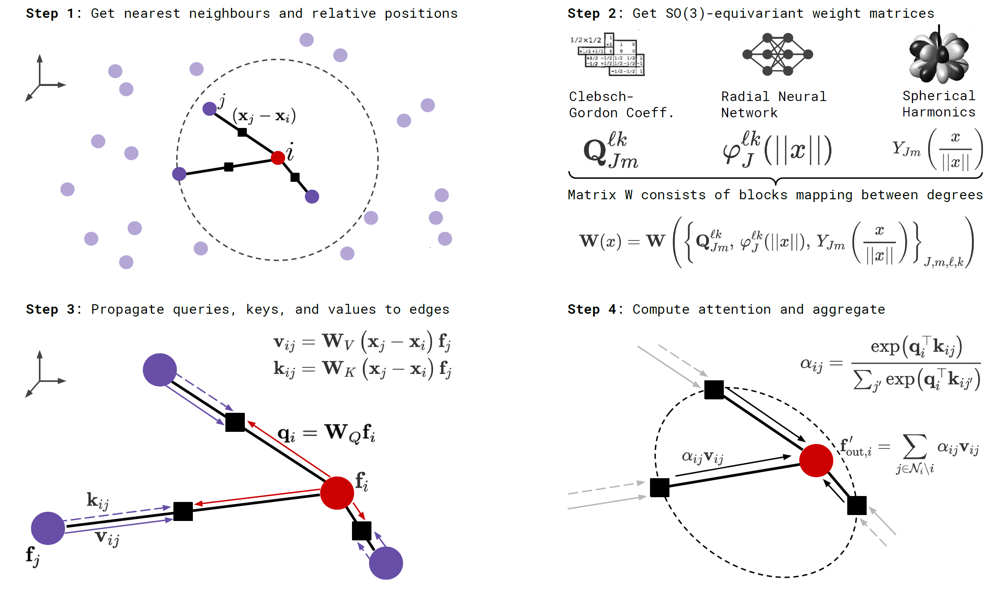

# Equivariant GNNs

## Preliminaries: Group Theory and Equivariance

This section is based on the [exellent materials on equivariant neural networks by Andrew White](https://dmol.pub/dl/Equivariant.html).

- **Group** $G = \langle V, \cdot \rangle$: a set $V$ equipped with a binary operation $\cdot$ that satisfies closure, associativity, identity and inverse properties.

- **Group action** $\pi(g, x)$: $\newcommand{\cX}{\mathcal{X}} G\times\cX \to \cX$ that satisfies identity and compatibility, i.e.\(\pi(g, \pi(h, x)) = \pi(gh, x)\).

!!! note "Notes on the group elements"
    We focus on groups of *transformations* here. E.g. "rotate 60° around the $z$-axis" is an element of the $\mathrm{SO}(3)$ group, which operates on 3D points ($\newcommand{\R}{\mathbb{R}}\cX = \R^3$).

### Combining translations and rotations

- **Left coset**: $gH := \{ gh : h \in H \le G \}, \forall g \in G$

- **Normal subgroup**: $N \triangleleft G \Longleftrightarrow \forall g \in G, gN = Ng \Longleftrightarrow \forall n \in N, \forall g \in G, gng^{-1} \in N$. Normal subgroups are invariant under conjugation.
    - $\forall g \in G, gNg^{-1}$ is an automorphism of N, *i.e.*, $gNg^{-1} \in \mathrm{Aut}(N)$.

- **(Outer) semidirect product**: Given two groups $N$ and $H$ and a group homomorphism $\phi: H \to \mathrm{Aut}(N)$, their outer semidirect product $N \rtimes_\phi H$ is defined as:
    - Underlying set: $N\times H$,
    - Group operation: $(n_1, h_1) \cdot (n_2, h_2) = (n_1\phi(h_1)(n_2), h_1h_2)$.

    For $N \triangleleft G$ and $H \le G$, we can define $\phi$ as $\phi(h) = \phi_h$ where $\phi_h(n) = hnh^{-1}$.

!!! example "Example: $\mathrm{SE}(3) = T(3) \rtimes \mathrm{SO}(3)$"
    - We first show that $\mathrm{T}(3) \triangleleft \mathrm{SE}(3)$. $\forall g \in \mathrm{SE}(3)$, we represent $g$ as $\newcommand{\vs}{\mathbf{s}}\begin{pmatrix}R&\vs\\0&1\end{pmatrix}$, $\forall t \in \mathrm{T}(3)$, we represent $t$ as $\newcommand{\vt}{\mathbf{t}}\begin{pmatrix}I_3&\vt\\0&1\end{pmatrix}$, then
    $g^{-1}tg = \begin{pmatrix}R^{-1}&-\vs\\0&1\end{pmatrix} \begin{pmatrix}I_3&\vt\\0&1\end{pmatrix} \begin{pmatrix}R&\vs\\0&1\end{pmatrix} = \begin{pmatrix}I&R^{-1}(\vs+\vt)-\vs\\0&1\end{pmatrix} \in \mathrm{T}(3)$.

    - We can decompose $\forall g = \begin{pmatrix}R&\vt\\0&1\end{pmatrix} \in \mathrm{SE}(3)$ into a translation $t = \begin{pmatrix}I_3&\vt\\0&1\end{pmatrix}$ and a rotation $r = \begin{pmatrix}R&0\\0&1\end{pmatrix}$, *s.t.* $(t, r)$ is equivalent to $g$.
    We now verify that $g_2g_1 = (t_2\phi_{r_2}(t_1), r_2r_1)$.
    Since $g_2g_1 = \begin{pmatrix}R_2R_1&R_2\vt_1+\vt_2\\0&1\end{pmatrix}$,
    it suffices to check that
    $t_2\phi_{r_2}(t_1) = t_2r_2t_1r_2^{-1} = \begin{pmatrix}0&R_2\vt_1+\vt_2\\0&1\end{pmatrix}$ as $r_2r_1 = \begin{pmatrix}R_2R_1&0\\0&1\end{pmatrix}$.

### Equivariance

- **Input data** $\newcommand{\vr}{\mathbf{r}}\newcommand{\vx}{\mathbf{x}}f(\vr) = \vx$: function $\cX \to \R^n$ where the domain $\cX$ is a homogeneous space (usually just the 3D Euclidean space) and the image is an $n$-dim feature space.

- **$G$-function transform $\newcommand{\bbT}{\mathbb{T}}\bbT_g: \cX^{\R^n} \to \cX^{\R^n}, f \mapsto f^\prime$**: Given a group element $g \in G$, where $G$ is on the homogeneous space $\cX$, $G$-function transform $\bbT_g$ transforms $n$-dim functions on $\cX$ such that $f^\prime(gx) = f(x)$, *i.e.*, $\bbT_g(f)(x) = f^\prime(x) = f(g^{-1}x)$.

!!! example "Example: Translation of an image"
    **Input function**: $f(x, y) = (r, g, b)$ that specifies the pixel values for three channels at each pixel position.

    **Group element**: $t_{10,0}$ that stands for moving the image to the right by 10 pixels.

    **Output of G-function transform associated with $t_{10,0}$**: $f^\prime(x, y) = f(x-10, y)$.

- **$G$-Equivariant Neural Network $\phi: \cX^{\R^n} \to \cX^{\R^d}$**: Given a group element $g \in G$, where $G$ is on the homogeneous space $\cX$, and $\bbT_g$ and $\bbT^\prime_g$ on $n$- and $d$-dim functions, respectively, $\phi$ is a linear map such that $\phi(\bbT_g f(x)) = \bbT^\prime_g\phi(f(x)),\ \forall f(x): \cX \to \R^n$.

!!! note "Briefly..."
    "Transform then encode" has the same effect as "encode then transform".

- **$G$-Equivariant Convolution Theorem**: A neural network layer (linear map) $\phi$ is $G$-equivariant if and only if its form is a convolution operator $*$:
    $$\newcommand{\dd}{\,\mathrm{d}}
    \phi(f)(u) = (f * \omega)(u) = \int_G f^{\uparrow G}(u g^{-1}) \omega^{\uparrow G}(g) \dd \mu(g)
    $$
    where $f: H \to \R^n$ and $\omega: H^\prime \to \R^n$ are functions on quotient spaces $H$ and $H^\prime$, and $\mu$ is the group Haar measure.
    - **Orbit** of element $x_0$: $Gx_0 = \{gx_0: g \in G\}$.
    - **Stabilizer subgroup** for $x_0$: $H_{x_0} = \{g \in G : gx_0 = x_0\}$.
    - **Orbit-stabilizer theorem**: there is a bijection between the set of cosets $G/H_{x_0}$ for the stabilizer subgroup and the orbit $Gx_0$, which sends $gH_{x_0} \mapsto gx_0$.
    - **Lifting up $f$**: $f^{\uparrow G}(g) = f(gx_0)$.
    - **Projecting down $f$**: $f_{\downarrow \cX}(x) = \frac{1}{|H_{x_0}|}\int_{gH_{x_0}}f(u)\dd \mu(u)$, where $g$ is found by solving $gx_0 = x$.
    - **Haar measure**: a generalization of the familiar integrand factor you see when doing integrals in polar coordinates or spherical coordinates. E.g. the Haar measure for SO(3) with \(R_zR_yR_z\) group representation is \(\frac{1}{8\pi^2}\sin\beta\).

!!! note "Briefly..."
    There is only one way to achieve equivariance in a neural network.

!!! example "Example: SO(3)"
    + Function: defined on points on the sphere $f(x) = \sum_i \delta(x - x_i)$, where $\Vert x_i \Vert_2 = 1$.
    + Group representation: $R_z(\alpha) R_y(\beta) R_z(\gamma)$.
    + Stabilizer $x_0$: $(0, 0, 1)$. Note that $(0, 0, 0)$ is not on the sphere.
    + Stabilizer subgroup $H_{x_0}$: rotations that only involve $\gamma$, *i.e.* $R_z(0) R_y(0) R_z(\gamma)$.
    + Coset for $g = R_z(\alpha^\prime) R_y(\beta^\prime) R_z(\gamma^\prime)$: $gH_{x_0} = \{ R_z(\alpha^\prime) R_y(\beta^\prime) R_z(\gamma^\prime + \gamma): \gamma \in [0, 2\pi]\}$.
    + Point in $\cX$ associated w/ this coset (by the orbit-stabilizer theorem): $gx_0 = R_z(\alpha^\prime) R_y(\beta^\prime) R_z(\gamma^\prime + \gamma) x_0 = R_z(\alpha^\prime) R_y(\beta^\prime) x_0$.
    + Quotient space $G/H_{x_0}$: $\mathrm{SO}(2)$.
    + Lifted $f$: Suppose $g = R_z(\alpha) R_y(\beta) R_z(\gamma) \in G$, then $f^{\uparrow G}(g) = f(gx_0) = f(R_z(\alpha) R_y(\beta) x_0)$.

### Group Representation

- **Linear representation of a group**: Let \(G\) be a group on an \(n\)-dimensional vector space \(V\). A linear representation of \(G\) is a group homomorphism: \(\newcommand{\bbC}{\mathbb{C}} \rho: G \to \mathrm{GL}(m, \bbC)\) where \(\mathrm{GL}(\bbC)\) is the space of \(m\)-by-\(m\) square invertible matrices with complex numbers, that satisfies \(\rho(g_1g_2) = \rho(g_1)\rho(g_2)\).
    - \(m\) is termed the **degree** of representation \(\rho\).
    - **Faithful representation**: There is a unique representation for every group element.
    - **Unitary representation**: \(\forall g \in G,\ \rho(g)\rho^\dagger(g) = I_m\). Equivalently, \(\forall u, v \in V, \langle \rho(g)u, \rho(g)v\rangle = \langle u, v\rangle\).

!!! example "Trivial Representation"
    The trivial representation maps every group element to \(I_m\).

!!! note "Linear group actions are valid representations"
    Suppose \(\pi(g, x)\) is a linear group action on \(V\). This implies \(V\) is a vector space. Define \(\rho(g): V \to V\) as a transformation on \(V\) s.t. \(\rho(g)(x) = \pi(g, x)\), then \(\rho(g_1g_2) = \rho(g_1)\rho(g_2)\). Also \(\forall x,\ \rho(e)(x) = \pi(e, x) = x \). Thus \(\forall x,\ \rho(g^{-1})(\rho(g)(x)) = \rho(e)(x) = x\), *i.e.* \(\rho(g)\) is invertible. Therefore, \(\rho\) is a linear representation of group \(G\).

- **The Unitarity Theorem**: we can always [choose](http://mathonline.wikidot.com/weyl-s-unitarity-trick) an invertible matrix \(S\) (for finite groups) such that the representation \(\rho^\prime(g) = S^{-1}\rho(g)S\) is unitary.
    - Without loss of generality, we can assume all representations we use are unitary or can be trivially converted to unitary.

- **Irreducible Representation (irrep)**: a representation that has only trivial subrepresentations.
    - A linear subspace \(W \subset V\) is called **\(G\)-invariant** if \(\forall g \in G\) and \(\forall w \in W\), \(\rho(g)w \in W\).
    - The co-restriction of \(\rho\) to \(\mathrm{GL}(W)\) is a **subrepresentation**.
    - **Composing irreps**:
        $$\DeclareMathOperator{\diag}{diag}
        \rho^\prime(g) = S^{-1}\rho(g)S = \diag \left(\rho^{(1)}(g), \dots, \rho^{(k)}(g)\right) = \rho^{(1)}(g) \oplus \dots \oplus \rho^{(k)}(g)
        $$

- **Encoding input function into the irrep space**: using the generalized Fourier transform,

    $$\newcommand{\N}{\mathbb{N}}
    \hat{f}(\rho_i) = \int_G \rho_i(u)f^{\uparrow G}(u) \dd \mu(u), \quad i \in \N.
    $$

    where \(\rho_i\) is the \(i\)-th irrep of \(G\), and \(\dd \mu(u)\) is the group Haar measure.

- **Irreps on SO(3)**: The [Wigner D-matrix](https://en.wikipedia.org/wiki/Wigner_D-matrix) is a unitary matrix in an irreducible representation of the groups SU(2) and SO(3).
    $$
    D_{m'm}^{l}(\alpha ,\beta ,\gamma )\equiv \langle lm'|{\mathcal {R}}(\alpha ,\beta ,\gamma )|lm\rangle =e^{-im'\alpha }d_{m'm}^{l}(\beta )e^{-im\gamma }
    $$

    $$
    d_{m'm}^{l}(\beta )=[(l+m')!(l-m')!(l+m)!(l-m)!]^{\frac {1}{2}}\sum _{s=s_{\mathrm {min} }}^{s_{\mathrm {max} }}\left[{\frac {(-1)^{m'-m+s}\left(\cos {\frac {\beta }{2}}\right)^{2l+m-m'-2s}\left(\sin {\frac {\beta }{2}}\right)^{m'-m+2s}}{(l+m-s)!s!(m'-m+s)!(l-m'-s)!}}\right]
    $$

    where \(l \in \N\) for SO(3). \(D_{m'm}^{l}\) has shape \((2l+1)\times(2l+1)\) and acts on space spanned by \(l\)-th degree polynomials. See [here](https://math.stackexchange.com/questions/40137/how-can-there-be-multiple-irreducible-representations-of-a-group-each-having-dis/40141#40141) for a more detailed explanation.

    - We can now replace convolutions of group functions with products of their irreducible representations. This is critical, since SO(3) convolutions would require a series of spherical integrals.

    - The first columns of the Wigner D-matrices are propto the spherical harmonics: \(D_{m0}^{l}(\alpha, \beta, \gamma) = \sqrt{2l+1} {Y_l^m}(\alpha, \beta)\).

<figure markdown>

<figcaption style="max-width: 80%">Spherical harmonics visualized on polar plots. The radius of the plot at a given polar and azimuthal angle represents the magnitude of the spherical harmonic, and the hue represents the phase.</figcaption>
</figure>

## Tensor-Field Networks
Tensor-field network (TFN)[^1] is a locally equivariant convolutional neural network.

### Layer Overview

Tensor field networks act on points with associated features.

**Input-Output** &emsp; A layer \(\newcommand{\cL}{\mathcal{L}}\cL\) takes a finite set \(S\) of vectors in \(\R^3\) and a vector in \(\cX\) at each point in \(S\) and outputs a vector in \(\newcommand{\cY}{\mathcal{Y}}\cY\) at each point in \(S\), where \(\cX\) and \(\cY\) are vector spaces:

$$
\cL(\vr_a, x_a) = (\vr_a, y_a).
$$

Let \(D^\cX\) be a representation of SO(3) on a vector space \(\cX\). The desired **rotation equivariance** can be written as

$$\newcommand{\cR}{\mathcal{R}}
\cL \circ \left[\cR(g)\oplus D^{\cX}(g)\right] = \left[\cR(g)\oplus D^{\cX}(g)\right] \circ \cL,
$$

where \(\left[\cR(g)\oplus D^{\cX}(g)\right](\vr_a, x_a) = \left(\cR(g)\vr_a, D^\cX(g)x_a\right)\).

**Decomposing representation** &emsp; There are multiple instances (channels) of each \(l\)-th rotation-order irreducible representations. For rotation order \(l\), we implement a tensor \(V^{(l)}_{acm}\) with shape \((|S|, C_l, 2l+1)\), where \(C_l\) is the number of channels.

**Choice of \(D^\cX\)** &emsp; The group elements are represented by Wigner D-matrices \(D^{(l)}\), which map \(g \in \mathrm{SO}(3)\) to \((2l+1)\times (2l+1)\) matrices. Note that \(D^{0}(g) = 1\) and \(D^{(1)}(g) = \cR(g)\).

The real sperical harnomics \(Y^{(l)}_m\) are equivariant to SO(3) (See [G-function transform](#equivariance)):

$$
Y^{(l)}_m\left(\cR(g)\hat{\vr}\right) = \sum_{m^\prime=-l}^lD^{(l)}_{mm^\prime}(g)Y_{m^\prime}^{(l)}(\hat{\vr})
$$

### Point Convolution

**Notation** &emsp; \(\vr\) is the coordinates of an input point relative to the convolution center, \(\hat{\vr}\) is \(\vr\) normalized to unit length, and \(r = \Vert\vr\Vert_2\).

**Convolution filters** &emsp; With \(l_i\) and \(l_f\) as the rotation orders of the input and filter, respectively, we define the following rotation-equivariant filter \(F^{(l_f, l_i)}: \R^3 \to \R^{(2l_f+1) \times (2l_i+1)}\):

$$
F_{cm}^{(l_f, l_i)}(\vr) = R_c^{(l_f, l_i)}(r)Y_m^{(l_f)}(\hat{\vr})
$$

where \(R_c^{(l_f, l_i)}: \R_+ \to \R\) is a learnable kernel.

**Combining representations w/ tensor products** &emsp; We need the layer output to also be a representation of SO(3), thus we have to combine the filter outputs.

The tensor product of two irreps \(u^{l_1}\) and \(v^{l_2}\) of orders \(l_1\) and \(l_2\) can be calculated as

$$
(u \otimes v)_m^{(l)} = \sum_{m_1=-l_1}^{l_1}\sum_{m_2=-l_2}^{l_2} C^{(l, m)}_{(l_1, m_1)(l_2, m_2)}u_{m_1}^{(l_1)}v_{m_2}^{(l_2)}
$$

where the \(C^{(l, l_1, l_2)} \in \R^{(2l+1) \times (2l_1+1) \times (2l_2+1)}\)s are Clebsch-Gordan coefficients. \((u \otimes v)_m^{(l)}\) is non-zero only when \(|l_1-l_2| \le l \le l_1+l_2\) and \(m = m_1 + m_2\).

!!! note "Clebsch-Gordan coefficients"
    For \(0\otimes 0 \to 0\), \(C^{(0, 0)}_{(0, 0)(0, 0)} \propto 1\), which correspondns to scalar multiplication.

    For \(1\otimes 0 \to 1\), \(C^{(1, i)}_{(1, j)(0, 0)} \propto \delta_{ij}\), which corresponds to scalar multiplication of a vector.

    For \(1\otimes 1 \to 0\), \(C^{(0, 0)}_{(1, i)(1, j)} \propto \delta_{ij}\), which corresponds to dot product of vectors.

    For \(1\otimes 1 \to 1\), \(C^{(1, i)}_{(1, j)(1, k)} \propto \epsilon_{ijk}\), which corresponds to cross products of vectors.

**Layer Definition** &emsp; A point convolution of a type-\(l_f\) filter on a type-\(l_i\) input yields outputs at \(2\min(l_i,l_f)+1\) different rotation orders \(l_o\) (b/t \(|l_i - l_f|\) and \((l_i+l_f)\), inclusive):

$$
\cL_{acm_o}^{(l_o)}(\vr_a, V_{acm_i}^{(l_i)}) = \sum_{m_f, m_i}C^{(l_o, m_o)}_{(l_f, m_f)(l_i, m_i)}\sum_{b \in S} F_{cm_f}^{(l_f, l_i)}(\vr_a - \vr_b)V_{bcm_i}^{(l_i)}.
$$

!!! note "What are we convolving?"
    We are convolving the kernel function \(W^{(l_o, l_i)}\) with the input function \(f^{(l_i)}\), where the latter is represented as Dirac function taking non-zero values on \(x_a\)'s only, *i.e.* \(f^{(l_i)}(\vr) = \sum_a V^{(l_i)}_{a} \delta(\vr - \vr_a)\):

    \[
    \cL^{l_o}_a(\vr_a, V^{(l_i)}) = \int_{x^\prime}W^{(l_o, l_i)}(\vr^\prime - \vr_a)f^{(l_i)}(\vr) \dd \vr^\prime = \sum_{b \in S} W^{(l_o, l_i)}(\vr^\prime - \vr_a) V^{(l_i)}_{a}.
    \]

    The kernel lies in the span of an equivariant basis \(\{W^{(l_o, l_i)}_{l_f}\}_{l_f=|l_o-l_i|}^{l_o+l_i}\):

    \[
    W^{(l_o, l_i)}(\vr) = \sum_{l_f}^{} R(r)W^{(l_o, l_i)}_{l_f}(\hat{\vr}),
    \qquad \text{where}\ 
    W^{(l_o, l_i)}_{l_f}(\hat{\vr}) = \sum_{m_f} Y_{m_f}^{(l_f)}(\hat{\vr})C^{(l_o, l_i, l_f)}_{\cdot \cdot m_f}.
    \]

### Self-Interaction

Self-interaction layers mix the components of the feature vectors of the same type within each point together.
They are analogous to 1x1 convolutions, and they act like \(l_f = 0\) (scalar) filters.
Suppose \(c^\prime\) and \(c\) are the input and output dimensions,

$$
\sum_{c^\prime}W^{(l)}_{cc^\prime}V^{(l)}_{ac^\prime m}.
$$

The same weights are used for every \(m\) for a given order \(l\).
Thus, the \(D\)-matrices commute with the weight matrix \(W\), i.e. this layer is equivariant for \(l > 0\).

Equivariance for \(l = 0\) is straightforward because \(D(0) = 1\) (we may also use biases in this case).

### Non-Linearity

The non-linearity layer acts as a scalar transform in the \(l\) spaces, *i.e.* along the \(m\) dimension.

$$
\begin{cases}
\eta^{(0)}\left( V_{ac}^{(0)} + b_c^{(0)} \right), & l=0; \\
\eta^{(l)}\left( \Vert V \Vert_{ac}^{(l)} + b_c^{(l)} \right) V_{acm}^{(l)}, & l>0.
\end{cases}
$$

where \(\Vert V \Vert_{ac}^{(l)} = \sqrt{\sum_m (V_{acm}^{(l)})^2}\) and \(\eta^{(l)}: \R \to \R\).

Since \(D\) unitary, \(\Vert D(g)V\Vert = \Vert V\Vert\), *i.e.* this layer is equivariant.

## SE(3)-Transformers

SE(3)-Transformer[^2] is an equivariant attention-based model for 3D point cloud / graph data. It is basically a GAT with TFN weight matrices.

Compared to [TFN](#tensor-field-networks), SE(3)-Transformers (1) allow a natural handling of edge features, (2) allow a nonlinear equivariant layer and (3) relieve the strong angular constraints on the filter (TFN filters only have learnable parameters in the angular direction).

<figure markdown>
{: style="width: 80%" .image-center }
<figcaption style="max-width: 80%">SE(3) Transformer layer.</figcaption>
</figure>

### Layer Overview

Recall that, given rotation orders \(k\) and \(l\), an \(k\)-to-\(l\) TFN layer (w/o nonlinearity) can be written as

\[\newcommand{\mW}{\mathbf{W}}\newcommand{\mQ}{\mathbf{Q}} \newcommand{\vf}{\mathbf{f}}
\vf^{l}_{\text{out}, i} = w^{ll}\vf^l_{\text{in}, i} + \sum_{k \ge 0} \sum_{j \ne i}^n \mW^{lk}(\vx_j - \vx_i) \vf^k_{\text{in}, j}
\]

where \(\mW^{lk}(\vx) = \sum_{J=|k-l|}^{k+l}R^{lk}_J(\Vert\vx\Vert)\mW_J^{lk}(\vx)\) and \(\mW_J^{lk}(\vx) = \sum_{m=-J}^J Y^J_m(\hat{\vx})\mQ^{lkJ}_{m}\). Here \(k\), \(l\), \(J\) correspond to \(l_i\), \(l_o\) and \(l_f\) in the TFN notations. The first term denotes self-interaction, or 1x1 convolution, and the second term denotes convolution.

The SE(3)-Transformer layer is defined as (\(\bigoplus\) is the direct sum, *i.e.* vector concatenation):

\begin{align}
\newcommand{\cN}{\mathcal{N}}
\newcommand{\mS}{\mathbf{S}}
\newcommand{\vq}{\mathbf{q}}
\newcommand{\vk}{\mathbf{k}}
\DeclareMathOperator{\softmax}{softmax}
\vq_i &= \bigoplus_{l \ge 0}\sum_{k \ge 0}\mW_Q^{lk} \vf_{\text{in}, i}^k \\
\vk_{ij} &= \bigoplus_{l \ge 0}\sum_{k \ge 0} \mW_K^{lk}(\vx_j-\vx_i) \vf^k_{\text{in}, j} \\
\alpha_{ij} &= \underset{j^\prime \in \cN_i \backslash i}{\softmax} \left( \vq_i^\top \vk_{ij} \right) \\
\vf^{l}_{\text{out}, i} &= \mW^{ll}_V \vf^l_{\text{in}, i} + \sum_{k \ge 0} \sum_{j \in \cN_i \backslash i} \alpha_{ij} \mW^{lk}_V (\vx_j - \vx_i) \vf^k_{\text{in}, j}.
\end{align}

Similarly, the first term denotes self-interaction and the second term denotes attention.
Equivariance is obvious as the attention weights are invariant (due to orthonormality of representations of SO(3), \((\mS_g\vq)^\top\mS_g\vk=\vq^\top\vk\)) and the value embeddings are equivariant w.r.t rototranslation.

### Self-Interaction

Self-interaction is an elegant form of learnable skip connection. It is crucial since, in the SE(3)-Transformer, points do not attend to themselves.
The authors propose two types of self-interaction layer, both of the form

\[
\vf^{\text{out}, i, c^\prime} = \sum_c w^{ll}_{i, c^\prime, c} \vf^{l}_{\text{in}, i, c}
\]

**Linear** &emsp; Same as TFN, weights per order are shared across all points. The self-interaction layer is followed by a [norm-based non-linearity](#non-linearity). Or, in math language, \(w_{i, c^\prime, c}^{ll} = w_{c^\prime, c}^{ll}\).

**Attentive** &emsp; Weights are generated from an MLP. This is an invariant layer due to the invariance of inner products.

\[
w_{i, c^\prime, c}^{ll} = \mathrm{MLP}\, \left(
    \bigoplus_{c, c^\prime} \vf^{l\top}_{\text{in}, i, c^\prime} \vf^l_{\text{in}, i, c}
\right)
\]

[^1]: N. Thomas and T. Smidt et al. Tensor field networks: Rotation- and translation-equivariant neural networks for 3D point clouds. NeurIPS 2018. [paper](https://arxiv.org/abs/1802.08219) [code](https://github.com/tensorfieldnetworks/tensorfieldnetworks)
[^2]: F. B. Fuchs, D. E. Worrall, V. Fisher, M. Welling. SE(3)-Transformers: 3D Roto-Translation Equivariant Attention Networks. NeurIPS 2020. [paper](https://arxiv.org/abs/2006.10503)