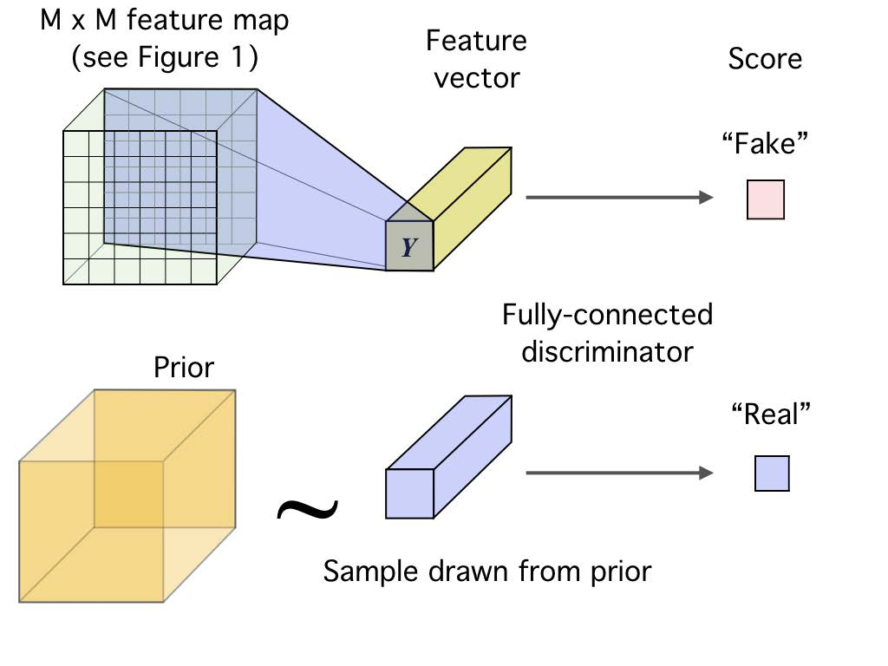

# Representation Learning with Mutual Information Maximization

## $f$-GAN

> 2016 NIPS - $f$-GAN: Training Generative Neural Samplers using Variational Divergence Minimization [^1]

### $f$-divergence

Suppose we want to train a generative model $Q$ that generates data as realistic (close to the true data distribution $P$) as possible. In other words, we wish to minimize the $f$-divergence

$$
\DeclareMathOperator{\Dcal}{\mathcal{D}}
\DeclareMathOperator{\Gcal}{\mathcal{G}}
\DeclareMathOperator{\Vcal}{\mathcal{V}}
\DeclareMathOperator{\Tcal}{\mathcal{T}}
\DeclareMathOperator{\Lcal}{\mathcal{L}}
\DeclareMathOperator{\lcal}{\mathcal{l}}
\DeclareMathOperator{\Xcal}{\mathcal{X}}
\DeclareMathOperator{\Zcal}{\mathcal{Z}}
\DeclareMathOperator{\E}{\mathbb{E}}
\DeclareMathOperator{\R}{\mathbb{R}}
\DeclareMathOperator{\dom}{\mathrm{dom}}
\DeclareMathOperator{\sign}{\mathrm{sign}}
\DeclareMathOperator{\KL}{\Dcal_{\mathrm{KL}}}
\DeclareMathOperator{\JS}{\Dcal_{\mathrm{JS}}}
\def\dd{\mathrm{d}}
\def\ee{\mathrm{e}}
\Dcal_f(P \Vert Q) = \int_{\Xcal} q(x) f\left(\frac{p(x)}{q(x)} \right) \dd x = \E_{q(x)} f\left(\frac{p(x)}{q(x)} \right)
$$

where $f:\R^+ \to \R$ is convex, lower-semicontinuous and satisfies $f(1) = 0$.

Below is a table of the $f$-divergence family.

|Name|$\Dcal_f(P \Vert Q)$|$f(u)$|$T^*(u)$|
|-----|-----|-----|-----|
|Total variation| $\frac{1}{2} \int \vert p(x) - q(x) \vert \dd x$ |$\frac{1}{2} \vert u - 1 \vert$|$\frac{1}{2} \sign (u - 1)$|
|Kullback-Leibler (KL)|$\int p(x)\log \frac{p(x)}{q(x)} \dd x$|$u \log u$|$1+\log u$|
|Reverse KL|$\int q(x)\log \frac{q(x)}{p(x)} \dd x$| $- \log u$|$-\frac{1}{u}$|
|Pearson $\chi^2$|$\int \frac{(q(x) - p(x))^{2}}{p(x)} \dd x$|$(1 - u)^{2}$|$2(u-1)$|
|Neyman $\chi^2$|$\int \frac{(p(x) - q(x))^{2}}{q(x)} \dd x$|$\frac{(1 - u)^{2}}{u}$|$1-\frac{1}{u^2}$|
|Squared Hellinger|$\int \left(\sqrt{p(x)} - \sqrt{q(x)}\right)^{2} \dd x$|$(\sqrt{u} - 1)^{2}$|$(\sqrt{u}-1)\sqrt{\frac{1}{u}}$|
|Jeffrey|$\int (p(x) - q(x))\log \left(\frac{p(x)}{q(x)}\right) \dd x$|$(u - 1)\log u$|$1+\log u - \frac{1}{u}$|
|Jensen-Shannon|$\frac{1}{2}\int p(x)\log \frac{2 p(x)}{p(x) + q(x)} + q(x)\log \frac{2 q(x)}{p(x) + q(x)} \dd x$|$-\frac{u  + 1}{2}\log \frac{1  + u}{2} + \frac{u}{2} \log u$|$\frac{1}{2}\log\frac{2u}{u+1}$|
|$\alpha$-divergence|$\frac{1}{\alpha (\alpha - 1)}\int p(x)\left[ \left(\frac{q(x)}{p(x)}\right)^\alpha - 1 \right] - \alpha(q(x) - p(x)) \dd x$|$\frac{1}{\alpha (\alpha - 1)}(u^\alpha - 1 - \alpha(u-1))$|$\frac{1}{\alpha - 1}\left( u^{\alpha-1} - 1 \right)$|

!!! note "Fenchel conjugate"
    The Fenchel conjugate of function $f(x)$ is defined as $f^*(x^*) = \sup_{x \in \dom f} \big\{ \langle x, x^* \rangle - f(x) \big\}$.

    We can easily verify that $f^*$ is convex and lower-semicontinuous. When $f$ is also convex and lower semi-continuous, $f^{**} = f$.

### Variational representation of the $f$-divergence

We now derive the variational lower bound on $f$-divergence:

$$
\begin{align}
\Dcal_f(P \Vert Q)
&= \int_{\Xcal} q(x) \sup_{t \in \dom f^*}\left\{t\frac{p(x)}{q(x)} -f^*(t) \right\} \dd x\\
&\ge \sup_{T \in \Tcal} \Big\{ \int_{\Xcal} p(x)T(x) \dd x - \int_{\Xcal} q(x)f^*(T(x)) \dd x \Big\}\\
&= \sup_{T \in \Tcal} \Big\{ \E_{p(x)}T(x) - \E_{q(x)}f^*(T(x)) \Big\}
\end{align}
$$

where $\Tcal$ is a class of functions $T: \Xcal \to \R$.
It is straightforward to see that the optimal $T^*(x) = f^\prime \left( \frac{p(x)}{q(x)} \right)$ (please do not confuse with conjugate function) by substituting the definition of $f^*$ and let $t$ be $\frac{p(x)}{q(x)}$

$$
\Dcal_f(P \Vert Q) \ge \E_{p(x)}T(x) - \E_{q(x)} \left[ \frac{p(x)}{q(x)}T(x) - f\left(\frac{p(x)}{q(x)}\right) \right] = \Dcal_f(P \Vert Q)
$$

The critical value $f^\prime(1)$ can be interpreted as a classification threshold applied to $T(x)$ to distinguish between true and generated samples.

### $f$-GAN Objective

We parameterize the generator $Q$ with parameter $\theta$ and the discriminator $T$ with parameter $\omega$. The $f$-GAN objective is then defined as

$$
\min_\theta \max_\omega F(\theta, \omega) = \E_{p(x)} T_\omega(x) - \E_{q_\theta(x)} f^*(T_\omega(x)).
$$

To account for $\dom f^*$ of various $f$-divergence, we further decompose $T_\omega(x)$ into $T_\omega(x) = g_f\big(V_\omega(x) \big)$, where $V_\omega: \Xcal \to \R$ is a neural network and $g_f : \R \to \dom f^*$ is an output activation function.

|Name|$g_f$|$\dom f^*$|$f^*(t)$|$f^\prime(1)$|
|----|----|----|----|----|
|Total variation|$\frac{1}{2}\tanh(v)$|$\left[-\frac{1}{2},\frac{1}{2}\right]$|$t$|$0$|
|Kullback-Leibler (KL)|$v$|$\R$|$\ee^{t-1}$|$1$| 
|Reverse KL|$-\ee^v$|$\R_-$|$-1 - \log(-t)$|$-1$|
|Pearson $\chi^2$|$v$|$\R$|$\frac{1}{4}t^2 + t$|$0$|
|Neyman $\chi^2$|$1-\ee^{v}$|$(-\infty,1)$|$2-2\sqrt{1-t}$|$0$|
|Squared Hellinger|$1-\ee^{v}$|$(-\infty,1)$|$\frac{t}{1-t}$|$0$|
|Jeffery|$v$|$\R$|$W(\ee^{1-t})+\frac{1}{W(\ee^{1-t})}+t-2$|$0$|
|Jensen-Shannon|$\frac{\log 2}{2}-\frac{1}{2}\log(1+\ee^{-v})$|$\left(-\infty,\frac{\log 2}{2}\right)$|$-\frac{1}{2}\log(2-\ee^{2t})$|$0$|
|$\alpha$-div. ($\alpha \in (0,1)$)|$\frac{1}{1-\alpha} - \log(1+\ee^{-v})$|$(-\infty, \frac{1}{1-\alpha})$|$\frac{1}{\alpha}(t(\alpha-1)+1)^{\frac{\alpha}{\alpha-1}} - \frac{1}{\alpha}$|$0$|
|$\alpha$-div. ($1<\alpha$)|$v$|$\R$|$\frac{1}{\alpha}(t(\alpha-1)+1)^{\frac{\alpha}{\alpha-1}} - \frac{1}{\alpha}$|$0$|

where $W$ is the Lambert-$W$ product log function.

## Mutual Information Neural Estimator (MINE)

> 2018 ICML - MINE: Mutual Information Neural Estimation [^2]

MINE has two variants termed MINE and MINE-$f$. The former uses the Donsker-Varadhan representation of the KL divergence, which results in a tighter estimator; the latter uses the $f$-divergence representation described above.

### The Donsker-Varadhan representation of KL

$$
\KL(P \Vert Q) \ge \sup_{T \in \Tcal} \left\{
    \E_{p(x)} T(x) - \log \E_{q(x)} \ee^{T(x)}
\right\}
$$

**Proof**: Consider the Gibbs distribution $g(x) = \frac{1}{Z} q(x) \ee^{T(x)}$ where $Z = \E_{q(x)} \ee^{T(x)}$. Then

$$
\begin{align}
\Delta
:&= \KL(P \Vert Q) - \E_{p(x)} T(x) - \log \E_{q(x)} \ee^{T(x)} \\
&= \KL(p(x) \Vert q(x)) - \E_{p(x)} T(x) - \log Z \\
&= \KL(p(x) \Vert q(x)) - \E_{p(x)} \big( T(x) - \log Z \big) \\
&= \E_{p(x)}\frac{p(x)}{q(x)} - \E_{p(x)} \frac{g(x)}{q(x)} \\
&= \KL(p(x) \Vert g(x)) \ge 0
\end{align}
$$

where $\Tcal$ is a class of functions $T: \Xcal \to \R$ such that the two expectations are finite. The equality holds when $g(x) \equiv p(x)$, i.e. $T^*(x) = \log \frac{p(x)}{q(x)} + C$.

### The $f$-divergence representation of KL

Adopting the [variational lower bound for $f$-divergence](#variational-representation-of-the-f-divergence), we have

$$
\KL(P \Vert Q) \ge \sup_{T \in \Tcal} \left\{ \E_{p(x)} T(x) - \E_{q(x)} \ee^{T(x) - 1} \right\}
$$

and the optimal $T^*(x) = 1+\log \frac{p(x)}{q(x)}$.

### Estimating Mutual Information

$$
I(X;Z) = \KL(p(x, z) \Vert p(x)p(z)) \ge \sup_{\theta \in \Theta} \left\{
    \E_{p(x,z)}T_\theta (x,z) - \log \E_{p(x)p(z)}\ee^{T_\theta(x,z)}
\right\}
$$

We estimate the expectations with empirical samples

$$
\hat{I}(X;Z)_n = \sup_{\theta \in \Theta} \Vcal(\theta) = \sup_{\theta \in \Theta} \left\{
    \E_{p^{(n)}(x,z)}T_\theta (x,z) - \log \E_{p^{(n)}(x)\hat{p}^{(n)}(z)}\ee^{T_\theta(x,z)}
\right\}
$$

When using stochastic gradient descent (SGD), the gradient update of MINE

$$
\nabla_\theta \Vcal(\theta) = \E_B \nabla_\theta T(\theta) - \frac{\E_B \ee^{T_\theta}\nabla_\theta T_\theta}{\E_B \ee^{T_\theta}}
$$

is a biased estimate of the full gradient update (**Why?**). This is corrected by an exponential moving average applied to the denominator.
For MINE-$f$, the SGD gradient is unbiased.

## Contrastive Predictive Coding (CPC) and the InfoNCE Loss

> 2010 AISTATS - Noise-contrastive estimation: A new estimation principle for unnormalized statistical models [^3]
> 
> 2018 NeurIPS - Representation Learning with Contrastive Predictive Coding [^4]

### Noise-Contrastive Estimation (NCE)

Suppose we have observed data $\mathbf{x} \sim p_d(\cdot)$ and we want to estimate a model from a family $\{p_\mathrm{m}(\cdot;\alpha)\}_\alpha$ where $\alpha$ is the model parameter. The challenge is that often it is more convenient to define an unnormalized model $p_\mathrm{m}^0$ such that

$$p_\mathrm{m}(\cdot;\alpha) = \frac{p_\mathrm{m}^0(\cdot;\alpha)}{Z(\alpha)} \quad \text{where} \ Z(\alpha) = \int p_\mathrm{m}^0(\mathbf{u};\alpha)\dd \mathbf{u}.$$

The integral $Z(\alpha)$ is rarely analytically tractable, and if the data is highdimensional, numerical integration is difficult. We include the normalization constant $Z(\alpha)$ as an additional parameter $c \approx -\log Z(\alpha)$, so that

$$\log p_\mathrm{m}(\cdot; \theta) = \log p_\mathrm{m}^0(\cdot; \alpha) + c \quad \text{where} \ \theta = {\alpha, c}.$$

Performing Maxmimum Likelihood Estimation (MLE) on this objective is not feasible as $c$ would be pushed to infinity. Instead we learn to discriminate between the data $\mathbf{x}$ and some artificially generated noise $\mathbf{y} \sim p_{\mathrm{n}}$. With $T$ positive (data) and $T$ negative (noise) examples, we define the NCE objective as

$$
\begin{align}
J_T(\theta) &= \frac{1}{2T} \sum_{t=1}^T \Big[ \log h(\mathbf{x}_t; \theta) + \log \big( 1 - h(\mathbf{y}_t; \theta) \big) \Big] \\
&= \frac{1}{2T} \sum_{t=1}^T \left[
    \log \frac{p_{\mathrm{m}}(\mathbf{x}_t; \theta)}{p_{\mathrm{m}}(\mathbf{x}_t; \theta) + p_{\mathrm{n}}(\mathbf{x}_t)} +
    \log \frac{p_{\mathrm{n}}(\mathbf{y}_t)}{p_{\mathrm{m}}(\mathbf{y}_t; \theta) + p_{\mathrm{n}}(\mathbf{y}_t)}
\right]
\end{align}
$$

where $h(\mathbf{u}; \theta) = \sigma\big(\log p_{\mathrm{m}}(\mathbf{u}; \theta) - \log p_{\mathrm{n}}(\mathbf{u}) \big)$.

This [blog post](https://zhuanlan.zhihu.com/p/334772391) (in Chinese) shows by gradient calculation that when the number of negative samples approches infinity, the NCE gradient equals to the MLE gradient.

### Contrastive Predictive Coding

Let $\{x_t\}$ be a sequence of observations, $z_t = g_{\mathrm{enc}}(x_t)$ be the encoded latent representation at time step $t$, and $c_t = g_{\mathrm{ar}}(z_{\le t})$ be the summarized context (global, ar for auto-regressive) latent representation at time step $t$. Given a set $X = \{x_1, \cdots, x_N\}$ of $N$ random samples containing one positive sample from $p(x_{t+k}|c_t)$ and $N - 1$ negative samples from the 'proposal' distribution $p(x_{t+k})$, we wish to preserve the mutual information between the $k$-step-later input $x_{t+k}$ and the current context $c_t$, by trying to identify the positive sample among all the samples:

$$
p(d=i|X, c_t) = \frac{p(x_i|c_t)\prod_{l \ne i}p(x_l)}{\sum_{j=1}^N p(x_j|c_t)\prod_{l \ne j}p(x_l)} = \frac{\frac{p(x_i|c_t)}{p(x_i)}}{\sum_{j=1}^N \frac{p(x_j|c_t)}{p(x_j)}}
= \frac{f_i(x_i, c_t)}{\sum_{j=1}^N f_j(x_j, c_t)}
$$

where $f_{k}(x_{t+k}, c_t) = C \frac{p(x_{t+k}|c_t)}{p(x_{t+k})}$ and $C$ is an arbitrary constant. Note that $f$ is unnormalized and can be parameterized by a simple log-bilinear model

$$
f_{k}(x_{t+k}, c_t) = \exp \big( z_{t+k}^T W_k c_t \big).
$$

To maximize our contrastive predictive capabilities, we minimize the following InfoNCE loss:

$$
\Lcal^{\mathrm{(InfoNCE)}} = -\E_X \left[ \log \frac{f_{k}(x_{t+k}, c_t)}{\sum_{x_j \in X} f_{k}(x_{j}, c_t)} \right]
$$

### Relation with Mutual Information

$$
I(x_{t+k}; c_t) \ge \log N - \Lcal^{\mathrm{(InfoNCE)}}
$$

**Proof**:

$$
\begin{align}
\Lcal^{\mathrm{(InfoNCE)}}
&= \E_X \log \Big(
    1 + \frac{p(x_{t+k})}{p(x_{t+k}|c_t)} \sum_{j \ne t + k} \frac{p(x_j|c_t)}{p(x_j)}
\Big) \\
&\approx \E_X \log \Big(
    1 + \frac{p(x_{t+k})}{p(x_{t+k}|c_t)} (N-1) \E_{x_j \in X_\mathrm{neg}} \frac{p(x_j|c_t)}{p(x_j)}
\Big) \\
&\approx \E_X \log \Big(
    1 + \frac{p(x_{t+k})}{p(x_{t+k}|c_t)} (N-1)
\Big) \\
&\ge \E_X \log \Big(
    N \frac{p(x_{t+k})}{p(x_{t+k}|c_t)}
\Big) \\
&= -I(x_{t+k}; c_t) + \log N
\end{align}
$$

Note that the approximation is more accurate as the number of negative samples increases.

### Relation with MINE

Let $F(x, c) = \log f(x, c)$, then

$$
\begin{align}
\Lcal^{\mathrm{(InfoNCE)}} &= -\E_X \left[ \frac{f_{k}(x_{t+k}, c_t)}{\sum_{x_j \in X} f_{k}(x_{j}, c_t)} \right] \\
&= \E_X F(x_{t+k}, c_t) - \E_X \log \big(\ee^{F(x_{t+k}, c_t)} \sum_{x_j \in X_{\mathrm{neg}}} \ee^{F(x_j, c_t)} \big) \\
&\le \E_X F(x_{t+k}, c_t) - \E_{c_t} \log \sum_{x_j \in X_{\mathrm{neg}}} \ee^{F(x_j, c_t)} \\
&= \E_X F(x_{t+k}, c_t) - \E_{c_t} \Big[ \log \frac{1}{N-1} \sum_{x_j \in X_{\mathrm{neg}}} \ee^{F(x_j, c_t)} + \log(N - 1) \Big]
\end{align}
$$

which is equivalent to the MINE estimator:

$$
\hat{I}(X;Z)_n = \sup_{\theta \in \Theta} \Vcal(\theta) = \sup_{\theta \in \Theta} \left\{
    \E_{p^{(n)}(x,z)}T_\theta (x,z) - \log \E_{p^{(n)}(x)\hat{p}^{(n)}(z)}\ee^{T_\theta(x,z)}
\right\}
$$

## Deep InfoMax (DIM)

> 2019 ICLR - Learning deep representations by mutual information estimation and maximization [^5]

Deep InfoMax is a principled framework for training a continuous and (almost everywhere)
differentiable encoder $E_\psi: \Xcal \to \Zcal$ to maximize mutual information between
its input and output, with neural network parameters $\psi \in \Psi$.

Assume that we are given a set of training examples on an input space, $\mathbf{X} := \{x^{(i)} \in \Xcal\}_{i=1}^N$, with empirical probability distribution $P$.
We define $U_{\psi,P}$ as the marginal distribution of $z=E_\psi(x)$ where $x$ is sampled from $P$, i.e., $u(z=E_\psi(x)) = \big( \nabla_x E_\psi(x) \big)^{-1} p(x)$.

We assert our encoder should be trained according to the following criteria:

- Local and global mutual information maximization
- Statistical constraints (prior in the latent space $v(z)$).

$$
\min_{\psi} - I(X; Z) + \lambda \KL(v(z)\Vert u(z))
$$

As a preliminary, we introduce the local feature encoder $C_\psi$, the global feature encoder $E_\psi = f_\psi \circ C_\psi$ and the discriminator $T_{\psi, \omega} = D_\omega \circ g \circ (C_\psi, E_\psi)$,
where $D_\omega$ is a neural classifier, and $g$ is a function that combines the local and global features.

The overall DIM objective consists of three parts, global MI, local MI and statistical constraints.

$$
\begin{align}
\max_{\omega_1, \omega_2, \psi} &\Big(
    \alpha \hat{I}_{\omega_1, \psi} \big( X; E_\psi(X) \big) + \frac{\beta}{M^2}\sum_{i=1}^{M^2} \hat{I}_{\omega_2, \psi} \big (X^{(i)}; E_\psi(X) \big)
\Big) + \\
&\min_\psi\max_\phi \gamma \hat{D}_\phi(V \Vert U_{\psi, P})
\end{align}
$$

In the following sections, we first introduce how to enfore statistical constraints $\hat{D}_\phi$ and local MI maximization, then discuss objectives for general MI maximization $\hat{I}$.

### Statistical Constraints

{: style="width: 70%" .image-center }

!!! note "Why use adversarial objectives for KL regularization?"
    Here we could also use VAE-style prior regularization $\min \KL \big(q(z|x) \Vert p(z) \big)$, but this assumes for every data point $x$, its latent $q(z|x)$ is close to $p(z)$. This will encourage $q(z)$ to pick the modes of $p(z)$, rather than the whole distribution of $p(z)$. See the [Adversarial AutoEncoders](https://arxiv.org/abs/1511.05644) paper for more details.

DIM imposes statistical constraints onto learned representations by implicitly training the encoder so that the push-forward distribution, $U_{\psi, P}$, matches
a prior $V$. Following [variational representation of the Jensen-Shannon divergence](#variational-representation-of-the-f-divergence), we optimize this objective by

$$
\min_\psi \max_\phi \JS(V \Vert U_{\psi, P}) = \E_{v(z)} \log D_\phi (z) + \E_{p(x)} \log (1 - D_\phi (E_\psi (x)))
$$

Note that the discriminator $D_\phi$ operates in the latent space rather than the input space.

### Local MI Maximization

Maximizing the mutual information b/t encoder input and output may not be meaningful enough. We propose to maximize the average MI between the high-level representation and local patches of the image. Because the same global representation is encouraged to have high MI with all the patches, this favours encoding aspects of the data that are shared across patches.

{: style="width: 70%" .image-center }

First we encode the input to a feature map, $C_\psi(x) = \{ C_\psi^{(i)} \}_{i=1}^{M\times M}$ that reflects useful structure in the data (e.g., spatial locality).
Next, we summarize this local feature map into a global feature, $E_\psi(x) = f_\psi \circ C_\psi(x)$.
We then define our MI estimator on global/local pairs, maximizing the average estimated MI:

$$
\max_{\omega, \psi} \frac{1}{M^2} \sum_{i=1}^{M^2} \hat{I}_{\omega, \psi}\big( C_\psi^{(i)}(X); E_\psi(X) \big).
$$

### MI Maximization Objectives

#### The Donsker-Varadhan Objective

This lower-bound to the MI is based on [the Donsker-Varadhan representation of the KL-divergence](#the-donsker-varadhan-representation-of-kl). It is the tightest possible bound on KL divergence, but it is less stable and requires many negative samples.

$$
I(X; Z) \ge \hat{I}^{\text{(DV)}}_{\psi, \omega} (X; Z) = \E_{p(x, z)} T_{\psi, \omega} (x, z) - \log \E_{p(x)p(z)} (\ee^{T_{\psi, \omega} (x, z)})
$$

#### The Jensen-Shannon Objective

Since we do not concern the precise value of mutual information, and rather primarily interested in its maximization, we could instead optimize on the Jensen-Shannon divergence. This objective is stable to optimize and requires few negative sample, but it is a looser bound to the true mutual information.

Following [$f$-GAN](#f-gan-objective) formulation, with output activation $g_f = -\log(1+\ee^{-v})$ and conjugate function $f^*(t) = -\log(1-\ee^t)$, we define the following objective:

$$
\begin{align}
&\hat{I}^{\text{(JS)}}_{\psi, \omega} (X; E_\psi(X)) \\
=& \widehat{\JS}(p(x, E_\psi(x)) \Vert p(x)p(E_\psi(x))) \\
=& \E_{p(x)} \Big[ \widetilde{T}_{\psi, \omega} (x, E_\psi(x)) - \E_{p(x^\prime)} f^*(\widetilde{T}_{\psi, \omega} (x^\prime, E_\psi(x))) \Big] \\
=& \E_{p(x)} \Big[ -\log \big(1 + \ee^{-T_{\psi, \omega}(x, E_\psi(x))} \big) - \E_{p(x^\prime)} \log \big(1 + \ee^{T_{\psi, \omega}(x^\prime, E_\psi(x))} \big) \Big] \\
=& \E_{p(x)} \Big[ \log \sigma \big( T_{\psi, \omega}(x, E_\psi(x)) \big) + \E_{p(x^\prime)} \log \Big( 1 - \sigma \big( T_{\psi, \omega}(x^\prime, E_\psi(x)) \big) \Big) \Big]
\end{align}
$$

where $\widetilde{T} = g_f \circ T$ is the discriminator output after activation $g_f$. In section A.1 of the DMI paper [^5], the authors show theoretically and empirically that $\max_{\psi, \omega} \JS(p(x, z) \Vert p(x)p(z))$ is indeed a good maximizer of $I(X; Z)$.

#### The InfoNCE Objective

This objective uses noise-contrastive estimation to bound mutual information. It obtains strong results, but requires many negative samples.

$$
\begin{align}
\hat{I}^{\text{(InfoNCE)}}_{\psi, \omega} (X; E_\psi(X)) &= \E_{p(x, z)} \bigg[
    T_{\psi, \omega}(x, E_\psi(x)) - \E_{p(x^\prime)} \Big[
        \log \sum_{x^\prime} \ee^{T_{\psi, \omega}(x^\prime, E_\psi(x)) }
    \Big]
\bigg]
\end{align}
$$

## Deep Graph Infomax

> 2019 ICLR - Deep Graph Infomax [^6]

Deep Graph Infomax (DGI) is a general approach for learning node representations within graph-structured data in an unsupervised manner. It relies on maximizing mutual information between patch representations and corresponding high-level summaries of graphs.

We first introduce

- The encoder $E: \R^{N \times F^{\mathrm{in}}} \times \R^{N \times N} \to \R^{N \times F}$ such that $E(\mathbf{X}, \mathbf{A}) = \mathbf{H} = (\mathbf{h}_1, \dots, \mathbf{h}_N)^\top$ produces node embeddings (or patch representations) that summarize a patch of the graph centered around node $i$.
- The readout function $R: \R^{N \times F} \to \R^F$ which summarizes the obtained patch representations into a graph-level representation $\mathbf{s} = R(E(\mathbf{X}, \mathbf{A}))$. It is implemented as a sigmoid after a mean $R(\mathbf{H}) = \sigma\left( \frac{1}{N} \sum_{i=1}^N \mathbf{h}_i \right)$.
- The discriminator $D: \R^F \times \R^F \to \R$ such that $D(\mathbf{h}_i, \mathbf{s})$ represents the logit scores assigned to this patch-summary pair (should be higher for patches contained within the summary). It is implemented as a bilinear function $D(\mathbf{h}_i, \mathbf{s}) = \mathbf{h}_i \mathbf{W} \mathbf{s}$.
- Negative samples are generated by pairing the summary vector $\mathbf{s}$ of a graph with patch representations $\widetilde{\mathbf{h}}_j$ from another graph $(\widetilde{\mathbf{X}}, \widetilde{\mathbf{A}})$. This alternative graph is obtained as other elements of a training set in a multi-graph setting, or by an explicit corruption function $(\widetilde{\mathbf{X}}, \widetilde{\mathbf{A}}) = C(\mathbf{X}, \mathbf{A})$ which permutes row-wise the node feature matrix $\mathbf{X}$.

Next we introduce the DGI objective for one training graph $\Gcal = (\mathbf{X}, \mathbf{A})$, based on [the Jensen-Shannon objective for Deep InfoMax](#the-jensen-shannon-objective)

$$
\begin{align}
\max \Lcal = \frac{1}{N + M} \bigg( &
    \sum_{i=1}^N \E_{x_i \sim V(\Gcal)} \log \sigma \big( D(\mathbf{h}_i, \mathbf{s}) \big) \\ + & 
    \sum_{j=1}^M \E_{\widetilde{x}_j \sim V(\widetilde{\Gcal})} \log \Big( 1 - \sigma \big(D(\widetilde{\mathbf{h}}_j, \mathbf{s}) \big) \Big)
\bigg)
\end{align}
$$

## InfoGraph

> 2020 ICLR - InfoGraph: Unsupervised and Semi-supervised Graph-Level Representation Learning via Mutual Information Maximization [^7]

InfoGraph studies learning the representations of *whole graphs* (rather than nodes as in DGI) in both unsupervised and semi-supervised scenarios. Its unsupervised version is similar to DGI except for

- Batch-wise generation of negative samples rather than random-sampling- or corruption-based negative samples.
- GIN methodologies for better graph-level representation learning.

In semi-supervised setting, directly adding a supervised loss would likely result in negative transfer. The authors alleviate this problem by separating the parameters of the supervised encoder $\varphi$ and those of the unsupervised encoder $\phi$, and adding a student-teacher loss which encourage mutual information maximization between the two encoders at all levels. The overall loss is:

$$
\begin{align}
\Lcal = & \sum_{G \in \Gcal_{\mathrm{l}}} \lcal (\widetilde{y}_\phi(G), y_G) + \\
& \sum_{G \in \Gcal_{\mathrm{l}} \cup \Gcal_{\mathrm{u}}} \frac{1}{|V|} \sum_{u \in V} \widehat{I}(h^u_\varphi(G), H_\varphi(G)) - \\
& \lambda \sum_{G \in \Gcal_{\mathrm{l}} \cup \Gcal_{\mathrm{u}}} \frac{1}{|V|} \sum_{k=1}^K \widehat{I}(H^{(k)}_\phi(G), H^{(k)}_\varphi(G))
\end{align}
$$

In practice, to reduce the computational overhead, at each training step, we enforce mutual-information maximization on a randomly chosen layer of the encoder.

[^1]: NeurIPS 2016 - [$f$-GAN: Training Generative Neural Samplers using Variational Divergence Minimization](https://arxiv.org/abs/1606.00709); A [blog post](https://kexue.fm/archives/6016) explaining the paper in Chinese.
[^2]: ICML 2018 - [MINE: Mutual Information Neural Estimation](https://arxiv.org/abs/1801.04062)
[^3]: AISTATS 2010 - [Noise-contrastive estimation: A new estimation principle for unnormalized statistical models](http://proceedings.mlr.press/v9/gutmann10a/gutmann10a.pdf)
[^4]: NeurIPS 2018 - [Representation Learning with Contrastive Predictive Coding](https://arxiv.org/abs/1807.03748)
[^5]: ICLR 2019 - [Learning deep representations by mutual information estimation and maximization](https://arxiv.org/pdf/1808.06670.pdf) ([slides](http://karangrewal.ca/files/dim_slides.pdf), [video](https://www.youtube.com/watch?v=o1HIkn8LEsw)); A [blog post](https://kexue.fm/archives/6024) explaining the paper in Chinese.
[^6]: ICLR 2019 - [Deep Graph Infomax](https://arxiv.org/abs/1809.10341). For relations with previous unsupervised graph representation learning methods, see the IPAM tutorial [Unsupervised Learning with Graph Neural Networks](http://www.ipam.ucla.edu/abstract/?tid=15546&pcode=GLWS4) by Thomas Kipf and also Daza's Master Thesis [A Modular Framework for Unsupervised Graph Representation Learning](https://dfdazac.github.io/assets/dd_thesis.pdf).
[^7]: ICLR 2020 - [InfoGraph: Unsupervised and Semi-supervised Graph-Level Representation Learning via Mutual Information Maximization](https://arxiv.org/abs/1908.01000)
